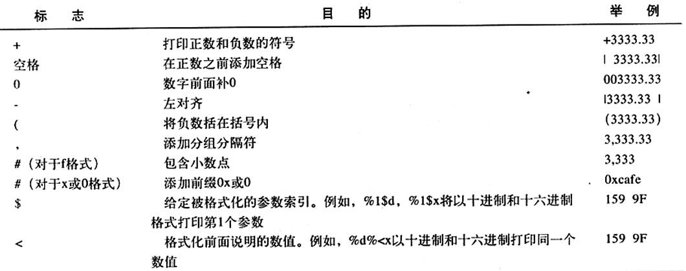

# 1--Java程序设计概述

### 特性

1. 简单性
2. 面相对象
3. 网络技能
4. 健壮性
5. 安全性
6. 体系结构中立
7. 可移植性
8. 解释性
9. 高性能
10. 多线程
11. 动态性

#### Java Applet——在网页中运行的java程序


查看版本

``` cmd
C:\Users\86177>java -version
java version "23.0.1" 2024-10-15
Java(TM) SE Runtime Environment (build 23.0.1+11-39)
Java HotSpot(TM) 64-Bit Server VM (build 23.0.1+11-39, mixed mode, sharing)
```

jdk23感觉也是没啥感觉


- desc包含了源码的HTML格式的文档
- src目录包含了java类库中的公共部分的源代码

**java源代码在src/java/lang/System.java**

#### 创建第一个java程序

```java
public class HelloWorld {

    public static void main(String[] args) {
        System.out.println("Hello World!");
    }
}
```

怎么启动呢

``` cmd
D:\gitpackages\Java\1>javac HelloWorld.java

D:\gitpackages\Java\1>java HelloWorld
Hello World！
```

**推荐类名开头大写**

# 3--Java基本程序结构

#### 标准命名规范：

- 类名以大写字母开头，如果由多个单词组成，则每个单词都大写例如**CamelCase**
- 源代码的文件名必须与共有类的名字相同，并用.java做拓展名
- 根据java语言规范，main方法必须是public

### 数据类型

**Java是强类型语言，意味着必须为每一个变量声明一种类型。**

#### 整型


在Java中整数的范围与运行Java代码的机器无关，解决了跨平台间数据转换的问题。C与C++则不一样，需要针对不同操作系统专门做优化。

长整型数值有一个后缀L（例如4000000L）,十六进制用前缀0x，八进制用0做前缀

#### 浮点型


float的数值后有前缀f，double也有d做后缀，不过一般默认不写

下面是三个表示溢出和出错的特殊浮点数值：

- 正无穷
- 负无穷
- NaN（不是数字）

**常量：Double.POSITIVE_INFINITY、Double.NEGATIVE_INFINITY、Double.NaN分别表示这三个数，不过用的很少**

浮点数不适用于禁止出现舍入误差的金融计算中，因为浮点数使用二进制表示的，无法精确表示例如$\frac{1}{10}$等数字

#### char型

用于表示单个字符

Unicode编码单元可以表示为16进制值，其范围才\u0000到\Uffff。

甚至转义序字符\u可以出现在字符常量或字符串的引号之外

``` java
public static void main(String\u0058\u005D args)
```


#### boolean 类型

**整型与布尔值不能互相转换，只用true和false**

#### 变量

在Java中，每一种变量属于一种类型

#### 变量名初始化

``` java
int x=1;
Box box=new Box();
```

**在这里左边是声明编译类型，右边是实际运行类型**

#### 常量

``` java
final double CM_PER_INCH=2.45
```

**final表示这个变量只被赋值一次，一旦赋值后不能再更改，习惯上常量名一般大写**

如果希望某个常量可以在一个类中被多个方法使用，通常将这些常量称为类常量，可以用`static final`设置一个类常量

#### 运算符

**默认情况下，虚拟机设计者允许将中间计算结果采用拓展的精度。但是对于使用strictfp关键字标记的方法必须用严格的浮点计算来产生理想的结果。**

``` java
public statc strictfp void main(String[] args)
```

实际的计算方法取决于Intel的处理器

#### ++和--

无需多言

#### 关系运算符与boolean运算符

&&和||是按照"短路"方式求值的，如果第一个操作数已经能够确定表达式的值，第二个操作数就不必计算了。

``` java
expression1&&expression2
```

如果第一个表达式值为false在&&的情况下，第二个表达式的值没必要计算。

三元操作

``` java
x<y?x:y;
```

#### 位运算符

1. &
2. |
3. ^亦或
4. ~非

位模式下工作

5. \>\>左移相当于十进制除以2
6. \<\<右移相当于十进制乘以2

7. \>\>\>表示用0填充高位
8. \>\>表示用符号为填充高位

#### 数学函数与常量

- Math.sin
- Math.cos
- Math.tan
- Math.atan
- Math.atan2
- Math.exp
- Math.log
- Math.PI
- Math.E

jdk5后不用导入Math包了

#### 数值类型的转换


#### 强制类型转换

``` java
double x=9.997;
int nx=(int) x;
```

此时nx=9假如要四舍五入要用

``` java
double x=9.997;
int nx=(int)Math.round(x);
```

此时nx=10

#### 括号与运算符优先级

假如不适用圆括号，就按照给出的运算符优先级次序来计算。


#### 枚举类型

jdk5开始可以自定义枚举类型

``` java
enum Size{SMALL,MEDIUM,LARGE,EXTRA_LARGE};
Size s=Size.MEDIUM;
```

**枚举只能是存储这个类型声明给定的某个值，或者是null**

### 字符串

Java给了一个预定义类String

#### 子串

``` java 
public class HelloWorld {

    public static void main(String[] args) {
        String hello="Hello World!";
        System.out.println(hello);
        System.out.println(hello.substring(0,3));
    }
}
```

结果

``` cmd
Hello World!
Hel
```

substring方法可以从String字符串里提取一个子串，这个子串从0开始，到3为止，但是不包含3

#### 拼接

Java允许用+号来进行拼接

#### 不可变字符串

Java没提供用于修改字符串的方法，想修改字符串只能

``` java
greeting=greeting.substring(0,3)+"p!";
```

在上面这个过程中，greeting变量通过修改引用了其他字符串的地址。

不可变字符串有一个优点：**编译器可以让字符串共享**

字符串变量指向的是**存储值相应的位置**，如果复制一个字符串变量原始字符串与复制的字符串享有共同的字符。

``` java
public static void main(String[] args) {
        String hello="Hello World!";
        String hello1=hello;
        System.out.println(hello);
        hello=hello.substring(0,5)+"!";
        System.out.println(hello);
        System.out.println(hello1);
    }
```

结果

``` cmd
Hello World!
Hello!
Hello World!
```

#### 检测字符串是否相等

``` java 
s.equals(t)
```

==是用来确定两个字符串是否在同一个位置上，即他们的地址是否相同

#### 代码点与代码单元

Java字符串是由char序列组成的。字符数据类型是一个采用了UTF-16编码表示的UNIcode代码点的代码单元。大多数常用Unicode字符使用一个代码单元就可以表示，而**辅助字符需要一对代码单元**表示。

``` java 
int n=greeting.length();
```

length方法返回的是UTF-16编码表示的给定字符串所需的代码单元数量

想要获得实际长度及代码点数量，可以调用：

```java
int cpCount=greeting.codePointCount(0,greeting.length);
```

例如：

```java
public static void main(String[] args) {
        char[] c = Character.toChars(Integer.parseInt("1D306", 16));//1D306是一个辅助平面字符
        System.out.println(Character.codePointAt(c, 0));//输出119558，这个是1D306对应的10进制值
        System.out.println(Character.codePointAt(c, 1));//输出57094，这个是c[1]对应字符的10进制值
        System.out.println(new String(c).codePointAt(0));//输出119558，这个是1D306对应的10进制值
        System.out.println(new String(c).codePointAt(1));//输出57094，这个是c[1]对应字符的10进制值
        String str = "abcdefg" + new String(c);
        System.out.println(str.length());//9
        System.out.println(str.codePointCount(0, str.length()));//8
    }
```

调用s.charAt(n)将返回位置n的代码单元


#### 字符串API

- char charAt(int index)

- int compareTo(String other)

- boolean endWith(Srting suffix)是以suffix结尾，return true

- boolean equals(Object other)

- boolean equalsIgnoreCase(String other)忽略大小写

- int indexOf(String str)返第一个匹配子串的位置，不存在返回-1

- int lastIndexOf(String str)返回最后一个匹配子串的位置，不存在返回-1

- String replace(CharSequence oldString,CharSequence newString)返回一个新字符串，用新的字符串替换**所有的**旧的字符串

- boolean startsWith(String predfix)如果字符串以predfix开头，返回true

  

#### 构建字符串

当需要许多小段的字符串构建一个字符串，可用StringBuilder类

``` java
StringBulider bulider=new StringBuilder();
```

当每次需要添加内容的时候就用append方法

``` java 
bulider.append(ch);
```

需要构建字符串的时候就用toString方法

``` java
String completedString=builder.toString();
```


### 输入输出

#### 读取输入

因为输入是可见的，所以Scanner类不适用于从控制台获取密码。Java SE 6特别引入Console类来实现这个目的。

``` java
Console cons=System.console();
String username=cons.readLine("User name:");
char[] passwd=cons.readPassword("password:");
```

当你在输入密码的时候，你看不到你控制台输入的内容。Console对象处理输入不如采用Scanner方便，每次只能一行输入，而没有能够读取一个单词 或一个数值的方法。


#### 格式化输出

java SE 5沿用了C语言库额度printf方法

``` java
System.out.printf("%8.2f",x);
```

表示用8个字符宽度和小数点后两个字符的精度打印x




对于任意实现了Fortmattable接口的对象都可以使用formatTo方法；否则可以调用toString发发，将对象转换为字符串


#### 文件输入与输出

想对文件进行读取，就需要用File对象构建一个Scanner对象

``` java
Scanner in=new Scanner(new File("myfile.txt"));
```

**如果文件名包括反斜杠号需用\\\，因为有转义字符的存在**

如果想要写入文件就需要构造一个PrintWriter对象

``` java
PrintWriter out=new PrintWriter("myfile.txt");
```


#### 控制流程

块：指由一对花括号括起来的若干条简单java语句


switch在使用枚举常量的时，不用在标签里致命枚举名，可以通过Switch的表达式值确定

``` java
Size sz=..;
{
    cas SMALL:
    	...
        break;
    ...
}
```

java 提供一种带标签的break，可以break跳出多重嵌套循环的循环语句。

``` java
Scanner in=new Scanner(System.in);
int n;
read_data:
while(...){
    for(...){
        System.out.print("Enter a number>=0:");
        n=in.nextInt();
        if(n<0)
            break read_data;
        ...
    }
}
```

continue是终断正常的控制流程，将控制转移到最内层循环的首部。

#### 大数值

##### BigInteger和BigDecimal

``` java
BigInteger a==BigInteger.valueOf(100);
```


#### 数组

数组是一种数据结构，用来存储同一类型值的集合。用一个整型下标可以访问数组中的每一个值。

``` java
int[] a=new int[100];
```

#### For each

java SE 5.0添加了一个功能很强的循环结构，可以用来依次处理**数组**中的每个元素。

``` java
for(int element:a)
    System.out.print(element);
```

print 默认调用的是输出对象的toString方法

#### 数组初始化及匿名数组

``` java
int[] smallPrimes={12,3,23,2,3};
```

匿名数组

``` java
new int[]{2,3,2,1};
```

**在java中允许数组的长度为0，这与null有差别**

```java
new a[0]
```

#### 数组拷贝

```java
int[] luckyNums=smallPrimes;
luckyNums[5]=12;//now smallPrimes[5] is also 12
```

因为此时数组变量拷贝到另一个数组是两个变量引用同一个数组，即此时两个数组的地址是一样的。

如果只希望拷贝数值，可以用Arrays类的copyOf方法。

``` java
int[] luckyNums=Arrays.copyOf(smallPrimes,2*luckyNums.length);
```

如果数组元素是数值型，多余的元素赋值为0；

如果是boolean型，赋值为false；

如果长度小于原始数组的长度，则只拷贝最签名的数据元素。

**数组to必须要有充足的空间方拷贝的元素**

#### 命令行参数

可以注意到每个java程序都有一个带有String arg[]参数的main方法。这个参数表名main方法将接收一个字符串数组，也就是**命令行参数**

写到93页了

``` java
public class Message{
    public static void main(String[] args){
        if(args[0].equals("-h"))
            System.out.print("Hello,");
        else if (args[0].equals("-g"))
            System.out.print("Goodbye,");
        for(int i=1;i<args.length;i++)
            System.out.print(" "+args[i]);
        System.out.println("!");
    }
}
```

输出：

``` cmd
PS D:\gitpackages\Java\1> javac Message.java
PS D:\gitpackages\Java\1> java Message -g cruel world
Goodbye, curel world!
```

因为传参的时候args数组包括下列内容：

- args[0]:"-g"
- args[1]:"cruel"
- args[2]:"world"

如果是

``` cmd
java Message -h world
```

**则args[0]是“-h”，在java识别中会被识别出h，如果直接输入h会被忽略**

#### 数组排序

``` java
Arrays.sort(a);
```

如何制作一个随机数值集合

``` java
import java.util.Arrays;

public class LotteryDrawing {
    public static void main(String[] args){
        int n=50,k=5;
        //设置范围
        int[] numbers=new int[n];
        for(int i=0;i<numbers.length;i++)
            numbers[i]=i+1;
        //抽取k个值
        int[] result= new int[k];
        for (int i = 0; i < k; i++) {
            int r=(int)(Math.random()*n);
            result[i]=numbers[r];
            numbers[r]=numbers[n-1];
            n--;
        }
        //抽取完后排序，看起来更合理
        Arrays.sort(result);
        for(int r:result)
            System.out.println(r);

    }
}
```


#### 多维数组

``` java
double[][] balances;
```

#### 不规则数组

java实际中没有多维数组，只有一维数组，多维数组被解释为 “数组的数组”。

故可以创建出不规则的数组

``` java 
for(int i=0;i<balances.length;i++){
    for(int j=0;j<balances[i].length;j++){
        double[] temp=balance[i];
        balance[i]=balance[i+1];
        balance[i+1]=temp;
    }
}
```

x写到102页
