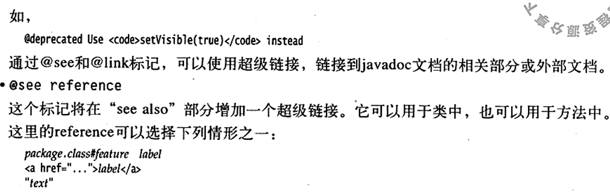

# 4---对象与类

- 面向对象程序设计
- 如何建立标准java类库中的类对象
- 如何编写自己的类

### 面向对象程序设计概述

面向对象程序设计（**OOP**）是当今最主流的程序设计范式，Java是完全面向对象的，必须熟悉OOP才能编写好Java程序

OOP：数据+算法

#### 类

类是构造对象的魔板或蓝图。

由类构造对象的过程称为**创建类的实例**

**封装：将数据和行为组合在一个包中，并对数据的使用者隐藏了数据的实现方式。**

对象中的数据称为实例域，操作数据的构成称为方法。

类可以通过拓展另一个类来建立，Java最顶级的类是Object类。在对一个已有类进行拓展时，这个拓展后的新类具有所拓展的类的全部方法和属性、

#### 对象

对象的三个主要特征：

- 对象的行为
- 对象的状态
- 对象标识

#### 识别类

名词与动词原则

#### 类之间的关系

- 依赖：uses-a
- 聚合：has-a
- 继承：is-a

如果一个类的方法操作另一个类的对象，就说一个类依赖于另一个类。

**应该尽量减少相互依赖的类**

### 使用现有类

#### 对象与对象变量

想要使用对象，就必须构造对象，并指定其初始状态，然后对对象施加方法。

在Java中用构造器创建新实例

构造器是一种特殊的方法，用来构造并初始化对象

**一个对象变量并没有实际包括一个对象，而仅仅只是引用一个对象**

如果一个方法应用于一个值为null的对象上，那么就会产生运行错误。

变量不会自动初始化为null，而是必须调用new或将他们设置为null进行初始化。

#### GregorianCalendar类

Date类的时间是距离一个固定时间点的毫秒数，这个点就是纪元：UTC时间1970年1月1日 00:00:00。

Date类只用了两个方法来比较两个时间点，before和after

``` java
if(today.before(birthday))
    System,out.println("Still time to shop for a gift.")
```

GregorianCalendar类有着更多的方法

#### 更改器方法与访问器方法

get+set+add

具体方法自己看文档

### 用户自定义类

想要创建一个完整的程序，应该将若干类组合在一起，其中只有一个类有main方法。

#### 一个Employee类

文件名必须与public类的名字相匹配。在一个源文件中，只有一个共有类，但可以有任意数量的非公有类。

#### 多个源文件的使用

java习惯于将每一个类存放在一个单独的源文件中。

#### 解析Employee类

类通常包括类型属于某个类的实例域

public意味着类的所有方法都可以调用这些方法，private确保只有Empoyee类自身能访问这些实例，其他类不能读写这些域

#### 从构造器开始

```java
public Employee(String name, String age, GregorianCalendar calendar, double salary) {
        this.name = name;
        this.age = age;
        this.calendar = calendar;
        this.salary = salary;
    }
```

构造器与类同名。在构造Employee类的对象时，构造器被运行，已将实例域初始化为所希望的状态

构造器总伴随着new操作符的执行被调用，而不能对一个已经存在额对象调用构造器来达到重新设置实例域的目的

**不能在构造器定义与实力域重名的局部变量**

#### 隐式参数与显式参数

- 隐式参数：出现在方法名前面的类对象
- 显式参数：位于方法名后括号中的数值

在每个方法中**this**表示隐式参数

#### 封装的优点

想获得或设置实例域的值，应提供以下三项内容：

- **一个私有的数据域**
- **一个共有的域访问器方法**
- **一个共有的域更改器方法**

优点：

- 可以改变内部实现，除了该类的方法之外，不会影响其他代码
- 更改器方法可以执行错误检查，然而直接对域进行赋值将不会进行这些处理

**不要编写返回引用对象的访问器方法，例如get方法，这样会破坏封装性**

```java
class Employee{
    private Date hireDay;
    public Date getHireDay(){
        return hireDay;
    }
}
```

这样写存在很大的风险，因为可能存在办法来更改这个雇员对象的私有状态

``` java
Employee harry=...;
Date d=harry.getHireDay();
double tenYearsInMillisSeconds=10*365.25*24*60*60*1000;
d.setTime(d.getTime()-(long)tenYearsInMillisSeconds)
//let's give Harry ten years added seniority
```

`getHireDay`方法直接返回`Date`对象的引用，这会破坏类的封装性，因为外部代码能够通过这个引用修改`hireDay`的值。为了保证数据安全，应当返回`Date`对象的**副本**。

``` java
class Employee{
    private Date hireDay;
    public Date getHireDay(){
        return (Date)hireDay.colne();
    }
}
```

#### 基于类的访问权限

#### 私有方法

有时可能希望将一个计算代码划分成若干个独立的辅助方法。通常这些方法不应该称为公有接口的一部分，所以最好设置成private

#### Final实例域

可以将实例域定义为final，构建对象时必须初始化这样的域。也就是说，必须确保在每一个构造器执行之后，这个域的值必须被设置，在后面的操作中，不能再对他进行修改。

final修饰符大都应用于基本数据类型

### 静态域和静态方法

#### 静态域

如果将域定义为static，每个类中只有一个这样的域。而每个对象对于所有的实例域却都有自己的一份拷贝

``` java
class Employee{
    private int id;
    private static int nextId=1;
}
```

每一个雇员对象都有自己的一个id域，但这个类的所有实例都将共享一个nextId域。

#### 静态常量

``` java
public class Math{
    public static final double PI=3.1415926;
}
```

#### 静态方法

静态方法是一种不能向对象实施操作的方法，静态方法没有隐式的参数，可以认为静态方法没有**this**参数

**因为静态方法不能操作对象，所以不能在静态方法中访问实例域，静态方法可以访问自身类中的静态域**

``` java
public static int getNextId(){
    return nextId;
}
调用方法：
    int n=Employee.getNexatId();
```

如何使用静态方法：

- 一个方法中不需要访问对象状态，其所需参数都是通过显式参数提供的
- 一个方法只需访问类的静态域

#### Factory方法

NumberFormat类使用factory方法产生不同风格的格式对象

``` java
public static void main(String[] args) {
        NumberFormat currencyInstance = NumberFormat.getCurrencyInstance();
        NumberFormat percentInstance = NumberFormat.getPercentInstance();
        double x=0.1;
        System.out.println(currencyInstance.format(x));
        System.out.println(percentInstance.format(x));
    }
```

为什么NumberFormat类不利用构造器完成这些操作呢？

- **无法命名构造器，构造器的名字与类名相同。这里希望所得到的货币实例和百分比实例采用不同的名字**
- **当使用构造器时，无法改变所构造的对象类型。**

#### Main方法

main方法不对任何对象进行操作。在启动程序时还没有任何一个对象，静态main方法将执行并创建程序所需的对象

### 方法参数

- 值调用：方法接收的是调用者提供的值
- 引用调用：方法接收的是调用者提供的变量地址

**java程序使用的总是值调用，方法所得到是所有参数值的一个拷贝，拷贝在接方法结束后被丢弃，方法不能修改传递给他的任何参数变量的内容**

方法参数有两种类型：

- 基本数据类型
- 对象引用

方法参数的使用情况：

- 一个方法不能修改一个基本数据类型的参数

- 一个方法可以改变一个对象参数的状态

  **解读：当对象作为参数传递时，传递的是对象的引用副本。尽管引用是副本，但它和原始引用指向同一个对象。所以，方法内可以通过这个引用副本修改对象的状态。**

- 一个方法不能实现让对象参数引用一个新的对象

``` java 
class Person {
    String name;

    public Person(String name) {
        this.name = name;
    }
}

public class ObjectParameterExample {
    public static void modifyPerson(Person p) {
        p.name = "Alice"; // 修改对象的状态
    }

    public static void main(String[] args) {
        Person person = new Person("Bob");
        modifyPerson(person);
        System.out.println(person.name); // 输出 Alice，对象状态被修改
    }
}
```

**解释**：在`main`方法中，创建了一个`Person`对象`person`，其`name`属性为 "Bob"。调用`modifyPerson(person)`时，传递的是`person`引用的副本，该副本和`person`指向同一个`Person`对象。在`modifyPerson`方法里，通过引用副本修改了对象的`name`属性为 "Alice"，所以`main`方法中`person`对象的`name`属性也随之改变。

### 对象构造

#### 重载

如果多个方法有相同的名字、不同的参数，便产生了重载

编译器必须挑选出具体执行哪个方法，他通过用各个方法给出的**参数类型**与特定方法调用**所使用的值类型**进行匹配挑选出对应的方法

#### 默认域初始化

如果构造器没有显式地给域赋予初值，那么就会赋默认值：数值为0，布尔值为false，对象引用为null

#### 默认构造器

``` java
public class(){
    name="";
    salary=0;
    hireDat=new Date();
}
```

如果编写类的时候没有编写构造器，系统就会提供一个默认构造器。

如果类中提供了至少一个构造器，但是没有提供默认构造器，则在构造对象时如果没有提供构造参数就会被视为不合法。

#### 显式域初始化

#### 参数名

``` java
public Employee(String name,double salary){
    this.name=name;
    this.salary=salary;
}
```

#### 调用另一个参数

如果构造器的**第一个语句形如this（...）**，这个构造器就可以调用同类的另一个构造器

``` java
public Employee(double s){
    //calls Employee(String,double)
    this("Employee#"+nextId,s);
    nextId++;
}
```

这个必须放在第一句，且每个公共的构造器代码部分只能编写一次

#### 初始化块

在一个类声明中，可以包括多个代码块。只要构造类的对象，这些块就会被执行

``` java
class Employee{
    ...
    {
        id=nextId;
        nextId++;
    }
    ...
}
```

无论使用哪个构造器构建对象，id域都在对象初始化块表示被初始化。

首先先运行初始化块，然后才运行构造器的主体部分

调用构造器的具体处理步骤：

1. **所有数据域被赋值为默认值**
2. **按照在类声明的出现的次序，依次执行所有域初始化语句和初始化块**
3. **如果构造器第一行调用了第二个构造器，则执行第二个构造器主体**
4. **执行这个构造器的主体**

如果对静态域进行初始化的代码比较复杂，那么可以使用静态的初始化块

#### 对象析构与finalize方法

在析构器中最常见的操作是回收分配给对象的存储空间。**由于java有自动的垃圾回收器，java不支持析构器**

可以为任何一个类添加finalize方法，finalize方法将在垃圾回收期清除对象之前调用。

**实际中，不要依赖于使用finalize方法回收任何稀缺的资源，因为不确定这个方法什么时候才能够被调用**

如果某个资源需要在使用完毕后立刻被关闭，那么就需要由人工来管理。可以应用一个类似dispose或close的方法完成相应的清理操作。

**如果一个类使用了这样的方法，当对象不再被使用时一定要调用他**

### 包

Java允许使用包将类组织起来，借助包可以方便地组织自己的代码，并将自己的代码与别人的代码库分开管理。

标准的Java包具有一个层次结构，所有标准 的Java好都处于Java和Javax包层次中

使用包的主要原因是确保类名的唯一性。

为确定包名的绝对唯一性，一般采取以公司的**因特网域名逆序**的形式为包名。

例如：com.horstman.corejava

#### 类的导入

我们可以采取两种方式来访问另一个包的公有类

- 在类名之前添加完整的包名

  ``` java
  java.util.Date today=new java.util.Date();
  ```

- 使用import语句

``` java
import java.util.*;
```

这样就可以使用该包的所有类

出现命名冲突时，应该要注意包的名字，此时会编译错误。假如必须要使用这两个包的同名类方法，就应该在每个类名前面加上完整的包名。

#### 静态输入

从java SE 5.0开始。import不仅能导入类，还增加了导入经验的方法和静态域的功能

``` java 
import static java.lang.System.*;
```

#### 将类放在包中

将类放在包里就需要在报名放在源文件的开头

``` java 
package com.horstaman.corejava;

public class Employee{
    ...
}
```

如果没有在源文件中放置package语句，那么这个源文件的类就被放在一个默认包中。这个默认包是一个没名字的包。

``` cmd
javac com/mycompany/PayrollApp.java
java com.mycompany.PayrollApp
```

**编译器是对文件进行操作，而java解释器加载类**

#### 包的作用域

java.awt包中的Window类存在未添加private的现象

### 类路径

类存储在文件系统的子目录中，类的路径必须与包名匹配

类文件也可以存储在jar文件中。在一个jar文件中，可以包含多个压缩形式的类文件和子目录。这样既可以节省还可以改善性能

为了使类能够被多个程序共享，需要做到以下几点：

1. 把类放在一个目录中，这个目录是包树状结构的基目录
2. 将jar文件放在一个目录中
3. 设置类路径，类路径是所有包含类文件的路径集合

理解：

- **类路径（classpath）是 Java 虚拟机（JVM）用来查找类文件的路径集合。它告诉 JVM 从哪些地方去寻找需要加载的类。**
- **JAR（Java Archive）文件是一种压缩文件格式，它可以将多个类文件、资源文件（如图片、配置文件等）打包在一起。这样做有很多好处，比如方便分发和部署。**

在UNIX环境中，类路径中的不同项目之间采用：来分割

```shell
/home/user/classdir:.:/home/user/archives/archive.jar
```

在Windows环境中，则用；来分割

```cmd
c:\classdir;.;c:\archives\archive.jar
```

上述两种情况**.** 表示当前目录

类路径包括：

- 基目录/home/user.classdir或c:\classes;
- 当前目录.
- jar文件/home/user/classdir:.:/home/user/archives/’*‘或c:\classdir;.;c:\archives\\*\*

在UNIX中，禁止使用*以防止shell命令进一步拓展

在归档目录中的所有jar文件中都包含在类路径中

由于运行库文件会被自动地搜索，所以不必将他们显式地列在类路径中

``` shell
/home/user/classdir:.:/home/user/archives/archive.jar
```

假定虚拟机要搜寻com.horstmann.corejava.Employee类文件。它首先要查看存储在jre/lib和jre/lib/ext目录下的归档文件中所存放的系统类文件，显然在那里找不到相应的类文件，然后再查看类路径

``` shell
/home/user/classdir/com/horstmann/corejava/Employee.class
com/horstmann/corejava/Employee.class从当前目录开始
com/horstmann.corejava/Employee.class inside /home/user/archives/archive.jar
```

##### 设置类路径

最好用-classpath或-cp选项指定类路径

```shell
java -classpath /home/user/classdir:.:/home/user/archives/archive.jar MyProg.java
```

或者

``` cmd
java -classpath c:\classdir;.;c:\archives\archive.jar MyProg.java
```

可以设置CLASSPATH环境变量完成这个操作

### 文档注释

javadoc,可以从源文件生成一个HTML文档

#### 注释的插入

- 包
- 共有类
- 共有和受保护的方法
- 共有的和受保护的域

应该为上面几部分编写注释，注释应该放在所描述特性的前面

注释以/**开始，以\*/结束，每个文档注释在标记之后紧跟着只有格式文本，标记由@开始。在自由格式文本中，可以使用HTML修饰符。

#### 类注释

注释必须放在import之后，类定义之前

#### 方法注释


#### 域注释

代只需对共有域建立文档

``` java
/**
* The "Hearts" card suit
*/
public static final int HEARTS=1;
```

#### 通用注释




#### 包与概述注释

如果想产生包注释，就需要把每一个包目录中添加一个独立的文件

- 提供一个以package.html命名的HTML文件。在标记<BODY>...</BODY>之间的所有文本都会被提取出来
- 提供一个以package-info.java命名的java文件。这个文件必须包含一个初始以/**和\*/界定的javadoc注释，跟随在一个包语句之后。他不应该包括更多的代码或注释
- 还可以写一个overview.html文件，这个文件位于包含所有源文件的父目录中

#### 注释的抽取

假设HTML文件将被存放在目录docDirectory下

1. 切换到包含想要生成文档的源文件目录

2. 如果是一个包，运行命令

   ```cmd
   javadoc -d docDirectory nameOfPackage
   ```

   对于多个包生成文档，运行

   ``` cmd
   javadoc -d docDirectory nameOfPackage_1 nameOfPackage_2...
   ```

   如果放在默认包中，就运行

   ``` cmd
   javadoc -d docDirectory *.java
   ```

### 类设计技巧

1. **一定要将数据设为私有**

2. **一定要对数据初始化**

3. **不要在类中使用过多的基本数据类型**

4. **不是所有额域都需要独立的域访问器和域更改器**

5. **使用标准格式进行类的定义**

   **书写顺序：**

   1. **公有访问特性部分**
   2. **包作用域访问特性部分**
   3. **私有访问特性**

   **顺序列出：**

   1. **实例方法**
   2. **静态方法**
   3. **实例域**
   4. **静态域**

6. **将职责过多的类进行分解**

7. **类名和方法名要体现他们的职责**


