# 5-继承

- 类、超类和子类
- Object：所有类的超类
- 泛型数组列表
- 对象包装器和自动打包
- 参数数量可变的方法
- 枚举类
- 反射
- 继承设计的技巧

### 类、超类和子类

``` java 
class Manager extends Employee{
    添加方法和域
}
```

通过拓展超类定义子类的时候，仅需指出子类和超类的不同之处。因此在设计类的时候，应该将通用方法放在超类，而将具有特殊用途的方法放在子类中。

``` java 
public double getSalary(){
    double baseSalary=getSalary();//still won't work
    return baseSalary+bonus;
}
```

上面这段代码会无法运行，因为Manager类自己也有一个getSalary方法，所以这条语句会无限次地调用自己，直到整个程序崩溃

这里可以用super

``` java
public double getSalary(){
    double baseSalary=super.getSalary();//still won't work
    return baseSalary+bonus;
}
```

**super与this引用不大一样，super不是一个对象的引用，不能将super赋给另一个对象变量，它只是一个指示编译器调用超类方法的特有关键字**

调用super构造器的语句必须是子类构造器的第一条语句

如果子类的构造器没有显式地调用超类的构造器，则将自动地调用超类默认（没有参数）的构造器。

如果超类没有不带参数的构造器，并且在子类的构造器中又没有显式地调用超类的其他构造器，则java编译器将报告错误

this有两个用途：

- 引用隐式参数
- 调用该类其他额度构造器

super有两个用途：

- 调用超类的方法
- 调用超类的构造器

**一个对象变量可以引用多种实际类型的现象被称为多态，运行时能够自动地选择调用哪个方法的现象称为动态绑定**

#### 继承层次

由一个公共超类派生出来的所有类的集合被称为继承层次

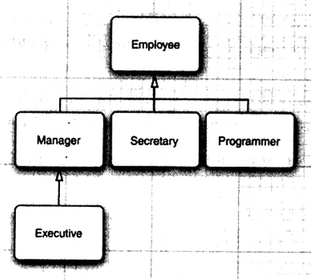

一个祖先类可以拥有多个子孙继承链

#### 多态

is-a规则的另一种表述法是置换法则，他表明程序中出现超类对象的任何地方都可以用子类对象置换

```java
Employee e;
e=new Employee(...);
e=new Manager(...);
```

在java程序设计中，对象变量是多态的。

``` java
Manager boss=new Manager(...);
Employee[] staff=new Employee[3];
staff[0]=boss;
```

staff[0]与boss引用的是同一个对象，但是编译器仍将staff[0]看成Employee对象。

意味着可以这样调用

```java
boss.setBonus(5000);//Ok
```

不可以这样调用

```java
staff[0].setBonus(5000);//ERROR
```

#### 动态绑定

调用过程的详细描述

1. 编译器查看对象的声明类型和方法名：编译器获得所有可能被调用的候选方法
2. 编译器将查看调用方法时提供的参数类型：编译器获得需要调用的方法名字和参数名字
3. 如果是private方法、static方法、final方法或构造器，那么编译器就可以很准确的知道应该调用哪个方法，这就是**静态绑定**
4. 当程序运行，并且采用动态绑定方法时，虚拟机一定调用与x所引用对象的事迹类型最适合的那个类方法

每次调用方法都需要进行搜索，虚拟机会预先为每个类建立一个**方法表**，其中列出了所有方法的签名和实际调用的方法。当真正调用方法的时候，虚拟机仅需查找这个表就行了

**动态绑定的重要特性：无需对现存代码进行修改就可以对程序进行拓展。**

#### 阻止继承：final类和方法

**如果将一个类声明为final，只有其中的方法自动地称为final，而不包括域**

final的使用：

- 确保他们不会在子类中改变语义
- 有的认为：除非有足够的理由使用多态性，应该将所有的方法都声明为final

#### 强制类型转换

将一个类型强制换成另外一个类型的过程被称为类型转换。

``` java
Manager boss=(Manager) staff[0];
```

进行类型转换的唯一原因：在展示忽视对象的实际类型之后，使用对象的全部功能

将一个子类的引用赋给一个超类变量，编译器是允许的。（向上转型）

向下转型需要满足：

- 只能在继承层次内进行转型
- 将超类转换成子类之前，应该用Instanceof进行检查

通过类型转换调用对象的类型不是一个好的做法，只有出现像需要Manage中特有的方法时才需要进行类型转换

一般情况下尽量少用类型转换和Instanceof运算符

#### 抽象类

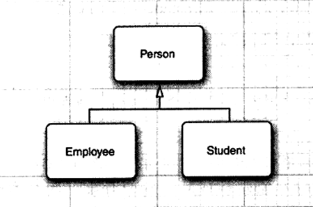

``` java
abstract class Person{
    public abstract String getDescription();
}
```

抽象类还可以包括具体数据和方法

``` java
abstract class Person{
    public Person(String n){
        name=n;
    }
    public abstract String getDescription();
    public String getName(){
        return name;
    }
    private String name;
}
```

抽象方法充当着占位的角色，他们的具体实现在子类中。拓展抽象类可以有两种选择：

- 在子类定义部分抽象方法或抽象方法也不定义，这样就必须将子类也标记为抽象类
- 另一种是定义全部的抽象方法，这样子类不是抽象的了

类即使不包含抽象方法，也可以将类声明为抽象类

抽象类不能被实例化，可以定义一个抽象类的对象变量，但他只能引用非抽象子类的对象

``` java 
Person p=new Student("小明","经济学");
```

```java
Person[] people=new Person[2];
people[0]=new Employee();
people[1]=new Student();
for(Person p:people){
    System.out.println(p.getDescription);
}
```

由于不能构造抽象类Person的对象，变量p永远不会引用Person对象，而是引用诸如Employee和Student这样具体子类对象，而这些子类对象都定义了getDescription方法

#### 受保护访问

有些时候希望超类中的某些方法允许被子类访问，或允许子类的方法访问超类的某个域。为此，需要将这些方法或域声明为protected

**四个访问修饰符：**

- **仅本类可见——private**
- **对所有类可见——public**
- **对本包和所有子类可见——protected**
- **对本包可见——默认**

### Object：所有类的超类

**Object类是java所有类的最终祖先，在java中每个类都是它拓展而来的**

**在java中只有基本数据类型不是对象**

#### Equals

在Object类中这个方法将判断两个对象是否具有相同的引用。

在子类中定义equals方法时，首先调用超类的equals

可以重写超类的equals

``` java
class Employee{
    public boolean equals(Object obj) {
        if (this == obj)
            return true;
        if (obj == null)
            return false;
        if (getClass() != obj.getClass())
            return false;
        Employee other = (Employee) obj;
        if (name == null) {
            if (other.name != null)
                return false;
        } else if (!name.equals(other.name))
            return false;
        if (id == null) {
            if (other.id != null)
                return false;
        } else if (!id.equals(other.id))
            return false;
        return true;
    }
}
```

这段 Java 代码是 `Employee` 类中重写的 `equals` 方法，用于比较两个 `Employee` 对象是否相等。该 `equals` 方法用于判断当前 `Employee` 对象和传入的 `obj` 对象是否相等。判断相等的依据是两个 `Employee` 对象的 `name` 和 `id` 属性都相等。

#### 相等的测试和与继承

如果隐式和显式的参数不属于同一个类，equals方法将如何处理？

尝试用Instanceof来进行检测

``` java
if(!(otherObject instanceof Employee)) return false;
```

这样并没有解决otherObject是子类的情况，而且还得可能有问题

java要求equals方法具有下面的特性：

1. 自反性：任意非空引用x，x.equals（x）应返回true
2. 对称性：任意引用x和y，当且仅当y.equals(y)返还true，x.equals（x）也应返回true
3. 传递性：任意引用x、y和z，如果x.equals(y)返还true，y.equals（z）返回true，那么x.equals(z)返还true
4. 一致性：如果x和y引用的对象没有发生变化，反复调用x.equals(y)应该返回相同的结果
5. 对于任意非空引用x，x.equals（null）应返回false

最终看法:

- 如果子类能够拥有自己的相等概念，则对称性需求将强制采用getClass进行检测
- 如果由超类决定相等的概念，那么就可以使用instanceof进行检测，这样可以在不同子类的对象之间进行相等的比较

例如，假如两个Manage对象锁拥有的姓名、薪水和雇佣日期均相等，而奖金不等，就认为他们是不同的，因此可以使用getClass来检测

当使用雇员id作为相等的检测标准，那么这个概念适用于所有子类，就可用instanceof来进行检测，并将Employee.equals声明为final

**完美equals方法：**

1. 显示参数命名为otherObject，稍后需要将他转换为另一个叫做other的变量
2. 检测this和otherObject是否引用同一个对象：`if(this==otherObject) return true;`
3. 检测otherObject是否为null，如果为null，返回false：`if(otherObject==null) return false;`
4. 比较this和otherObject是否属于同一类，如果equals的语义在每个子类有所改变，则用getClass检测：`if(getClass!=otherObect.getClass()) return false;`如果所有子类都拥有统一的语义，就使用instanceof检测：`if(!(otherObejct instanceof ClassName)) return false;`
5. 将otherObject转换为相应的类类型变量：`ClassName other=(ClassName) otherObject;`
6. 现在开始对所有需要比较的域进行比较，使用==比较基本数据类型，用equals比较对象域，如果所有的域 都匹配，则返回true，否则返回false

``` java
return field_1==other.field_1
    && field_2.equals(other.field_2)
    &...;
```

可以用@Override来在程序中判断是否重写了超类方法

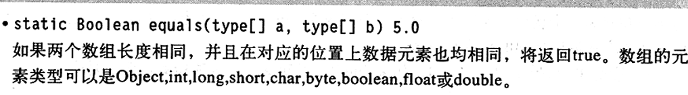

#### HashCode方法

如果x和y是两个不同的对象，那么x.hashCode()与y.hashCode()基本不会相同

**Equals与hashCode的定义必须一致：如果x.equals(y)返回true，那么x.hashCode()就必须与y.hashCode()拥有相同的值**

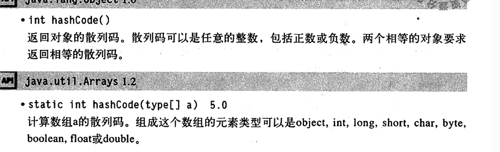

#### ToString方法

可以通过getClass().getName()来获得类名的字符串

只要对象与一个字符串通过操作符“+”连接起来，java编译就会自动地调用toString方法

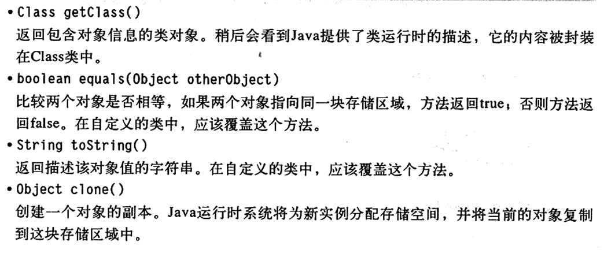

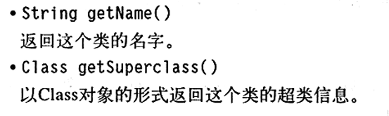

### 泛型数组列表

如何解决动态数组的问题，用ArrayList类

Array是一个采用类型参数的泛型类。

``` java
ArrayList<Employee> staff=new ArrayList<Employee>();
```

这是一个自适应大小的数组列表，可以使用add方法将元素添加到数组列表中

``` java
staff.add(new Employee("小明",...));
staff.add(new Employee("小红",...));
```

**数组列表管理者对象引用的一个内部数组，当数组的全部空间被用完时，内部数组列表就自动创建一个更大的数组，并将所有的对象从较小的数组拷贝到较大的数组**

如果已经清除或能够估计出数组可能得存储的元素数量，就可以在填充数组之前调用ensureCapacity方法：

```java
staff.ensureCapacity(100);
```

也可以将初始容量传递给ArrayList构造器

``` java
ArrayList<Employee> staff=new ArrayList<Employee>(100);
```

size将返回数组列表中的实际元素数目

```java
staff.size()
```

等价于数组a的a.length

一旦确定了数组列表的大小不再变化民安额就可以调用trimToSize方法，这个方法将存储区域的大小调整为当前元素数量所需有的存储空间数目，垃圾回收器将回收多余的存储空间

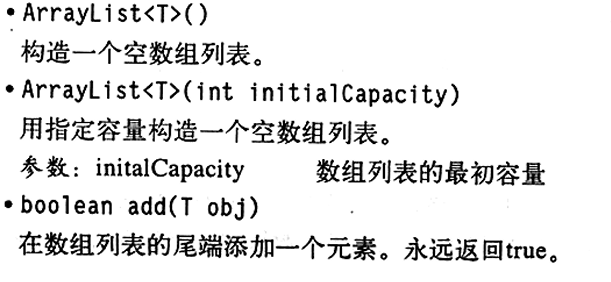

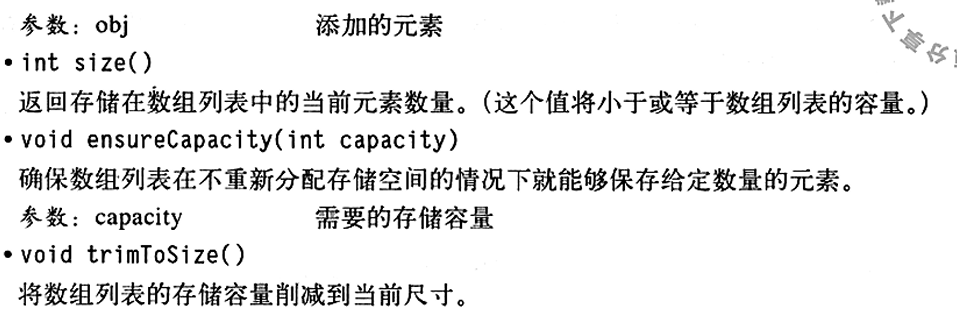

#### 访问数组列表

用set和get方法实现改变和访问数组元素的操作

set只能替代数组中已经存在的元素内容

add方法支持在索引位置插入元素

``` java
Array<X> list =new ArrayList<X>();
while(...){
    x=...;
    list.add(x);
}
```

执行完上述操作后，可以用toArray方法将数组元素拷贝到一个数组中

``` java
X[] a=new X[list.size()];
list.toArrat(a);
```

想要删除元素用remove

``` java
Employee e=staff.remove(n);
```

位于这个位置之后的所有元素都向前移动一个位置，并且数组的大小减一

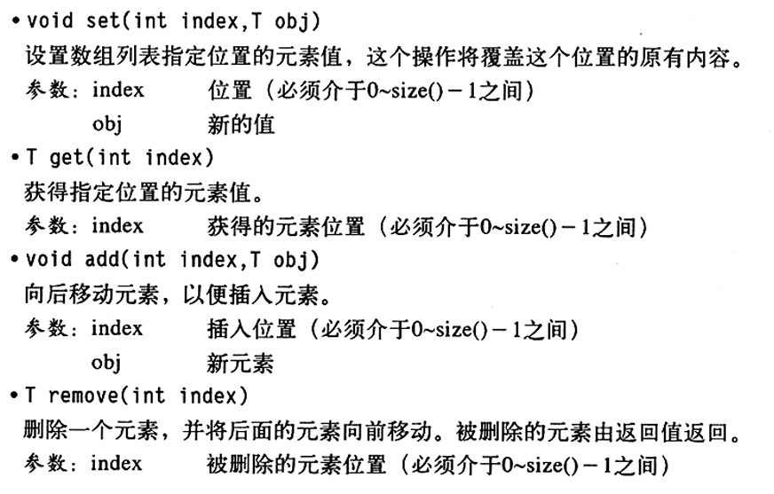

#### 类型化与原始数组列表的兼容性

鉴于兼容性的考虑，编译器在对类型进行检查之后，如果没有发现违反规则的现象，就将所有类型化数组列表转换成原始ArrayList对象。即ArrayList和ArrayList<Employee>将执行相同的运行时检查

### 对象包装和自动打包

所有基本类型都有一个与之对应的类，这些类称为包装器。

- Integer
- Long
- Float
- Double
- Short
- Byte
- Character
- Void
- Boolean

前面6个类派生于公共的超类Number，对象的包装器是不可变的，一旦构造了包装器，就不允许更改包装在其中的值。同时包装器还是final，因此不能定义他们的子类

```java
ArrayList<Integer> list=new ArrayList<Integer>();
list.add(3);
//等价于
list.add(new Integer(3));
```

这种变换称为**自动打包**

``` java
int n=list.get(i);
//翻译成
int n=list.get(i).intValue();
```

**自动包装规范要求boolean、byte、char<=127，介于-128到127之间的short和int被包装到固定的对象中**

打包和拆包是编译器认可的，而不是虚拟机，当编译器在生成类的字节码时，插入必要的方法调用。虚拟机只是执行这些字节码

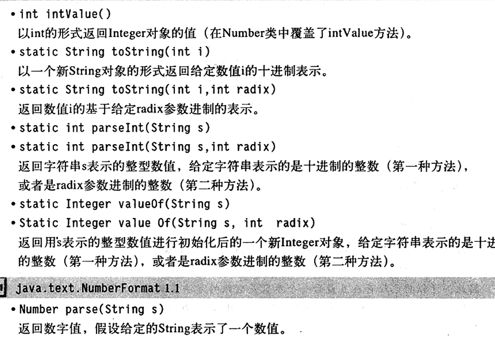

#### 参数数量可变的方法

```java
public static double max(double... values){
    double largest=Double.MIN_VALUE;
    for(double v:values) if(v>largest) largest=v;
    return largest;
}
```

可以将已经存在且最后一个参数是数组的方法重新定义为可变参数的方法，而不会破坏封装性

### 枚举类

``` java
enum Size{
    SMALL("S"),MEDIUM("M"),LARGE("L"),EXTRRA_LARGE("XL");
    private Size(String abbreviation){
        this.abbreviation=abbreviation;
    }
    public String getAbbreviation(){
        return abbreviation;
    }
    private String abbreviation;
}
```

所有枚举类型都是Enum类的子类，他们继承了这个类的许多方法

``` java
Size s=(Size) Enum.valueOf(Size.class,"Small");
```

将s设置成Size.SMALL

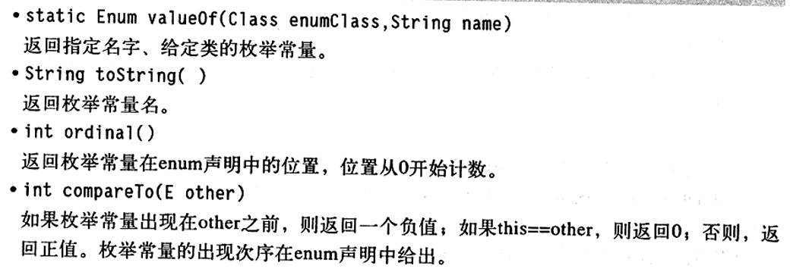

### 反射

- 在运行中分析类的能力
- 在运行中查看对象
- 实现数组的操作代码
- 利用Method对象

反射是一种功能强大且复杂的机制，使用他的主要对象是工具构造者

#### Class类

java系统运行时系统始终为所有的对象维护者一个被称为运行时的类型标识，这个信息保存着每个对象所属的类足迹，虚拟机利用运行时信息选择相应的方法执行。可以使用java类访问这些信息，保存这些信息的类被称为Class，

```java
Employee e;
Class cls=e.getClass();
```

如同一个Employee对象表示一个特定的雇员属性一样，一个Class对象将表示一个特定类的属性

```java
e.getClass().getName()
```

如果e是雇员会打印出Employee；如果是经理，则打印Manager

如果类在一个包里，包的名字也作为类名的一部分

``` java
String className="java.util.Date";
Class cls=Class.forName(ClassName);
```

调用静态方法forName获得类名对应的Class对象，如果类名保存在字符串中，并可以在运行中改变，就可以使用这个方法

如果T是任意类型的java类型，T.class将代表匹配的类对象

```java
Class cls1=Date.class;
Class cls2=int.class;
Class cls3=Double[].class;
```

虚拟机为每个类型管理一个Class对象,因此可以利用==来实现两个类对象比较的操作

创建一个类的实例，以前是用

```java
e.getClass().newInstance();
```

现在用

``` java
e.getClass().getDeclaredConstructor().newInstance();
```

#### 捕获异常

- 未检查异常：编译器会检查是否提供处理器
- 已检查异常

``` java
try{
    ...
}catch(Exception e){
    ...
}finally{
    ...
}
```

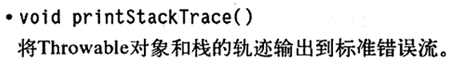

#### 利用反射分析类的功能

java.lang.reflect包中有3个类：Field、Method和Constructor分别用于描述类的域、方法和构造器。

Class类中的getFields、getMethods和getConstructors方法分别返回类提供的public域、方法和构造器数组，其中包括超类的共有成员

Class类中的getDeclareFields、getDeclareMethods和getDeclareConstructors方法分别返回类声明的全部域、方法和构造器数组，其中包括私有和受保护成员，但不包括超类的成员。

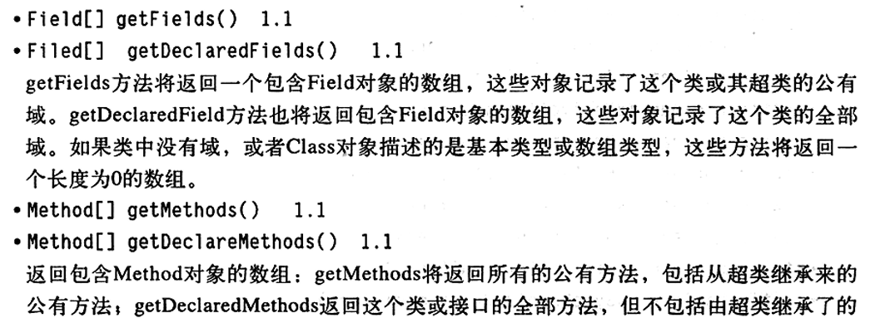

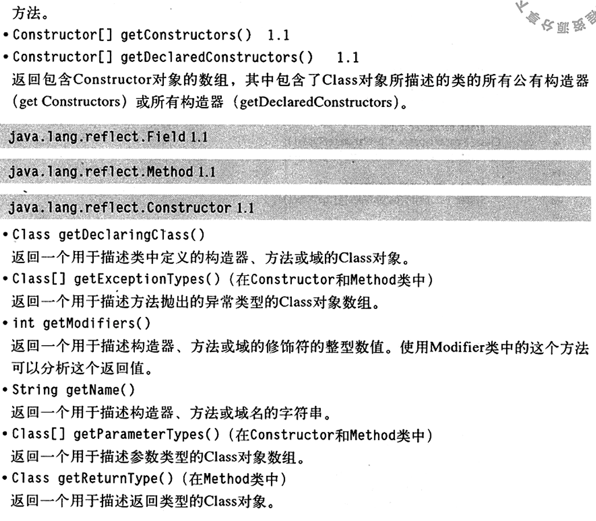

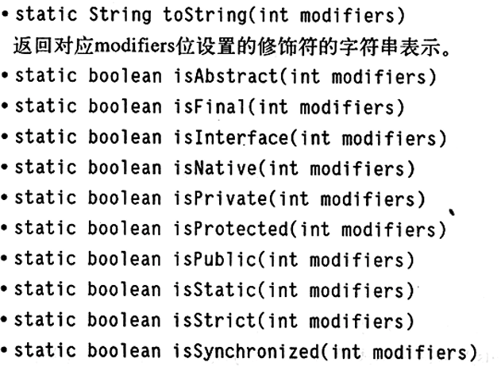

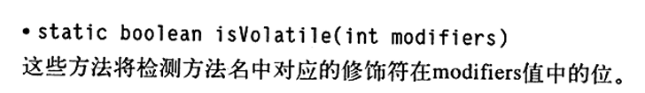

#### 在运行时使用反射分析对象

```java
Employee harry=new Employee("Harrt Hacker",35000,10,1,1989);
Class cls=harry.getClass();
//the class object representing Employee
Field f=cls.getDeclaredField("name");
//the name field of the Employee class
Object v=f.get(harry);
//the value of the name field of the harry object
//i.e.,the String object "Harry Hacker"
```

这段代码存在一个问题，由于name是一个私有域，所以get方法会抛出一个IllegalAccessException。只有用get方法才能得到可访问域的值。除非拥有访问权限，否则java安全机制只允许查看任意对象有哪些域，而不允许读取他们的值。

``` java
f.setAccessible(true);//now OK to call f.get(harry)
```

这个返回的是Object，但假如想看salary域，它属于double类型，而java中数值类型不是对象。反射机制会自动将这个域值打包到相应的对象包装器中，这里将打包成Double

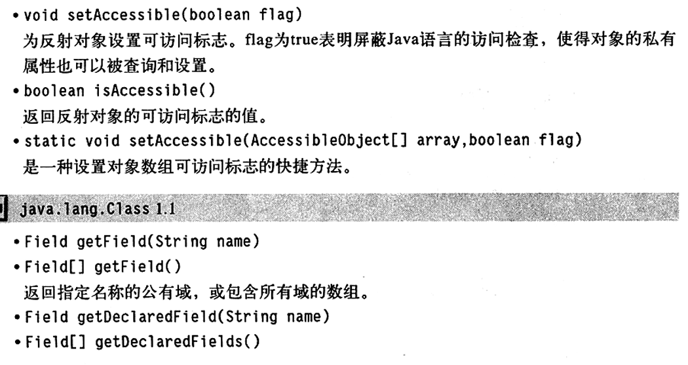

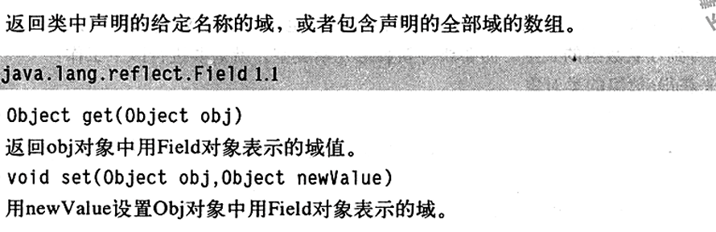

#### 使用反射编写泛型数组代码

``` java
Object newArray=Array.newInstance(componentType,newLength);
```

调用他时必须提供两个参数，一个是数组的元素类型，一个是数组的长度。要获得新数组元素类型，就需要：

1. 首先获得a数组的类对象
2. 确认他是一个数组
3. 使用Class类的getComponentTyoe方法确定数组对应的类型

211页程序

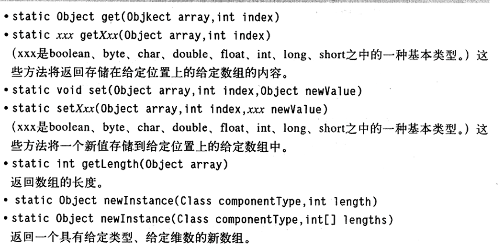

#### 方法指针

Method类有一个invoke方法，它允许调用包装在当前Method对象中的方法

``` java
Object invoke(Object obj,Object... args)
```

第一个参数为隐式参数，其余对象提供了显式参数

对于静态方法，第一个参数可以被忽略，即可以给他设置成null

``` java
String n=(String)m1.invoke(harry);
```

如果参数或返回类型不是类而是基本类型，那么调用Field类的get和set方法时会存在一些问题。需要依靠自动打包功能将其打包

如果返回的是一种基本数据类型，则invoke将返回包装器类型

``` java
double n=(double)m1.invoke(harry);
```

``` java
Method getMethod(String name,Class... parameterType)
```

获取想要的方法

``` java
Method m1=Employee.class.getMethod("getName");
Method m2=Employee.class.getMethod("raiseSalary",double.class);
```

invoke的参数和返回值必须是Object类型，意味着必须进行多次类型转换。最好仅在必要时采用Method对象，最好使用接口和内部类

### 继承设计的技巧

1. 将公共操作和域放在超类

2. 不要使用受保护的域

   **protected机制不能带来更好的保护**

   1. 子类的集合是无线的，任何一个人都能够由某个类派生一个子类，并编写代码以直接访问protected的实例域，从而破坏了封装性
   2. 在java程序设计中，同一个包中的所有类都能访问protected域，无论他是否我这个类的子类

3. 使用继承实现is-a关系

4. 除非所有继承的方法都有意义，否则不要使用继承

5. 在覆盖方法时，不要改变预期的行为

6. 使用多态，而非类型信息

7. 不要过多地使用反射

   **反射是很脆弱的即编译器很难帮助人们发现程序中的错误，任何错误只能在程序运行时才被发现，并导致异常**

over了:smiley: