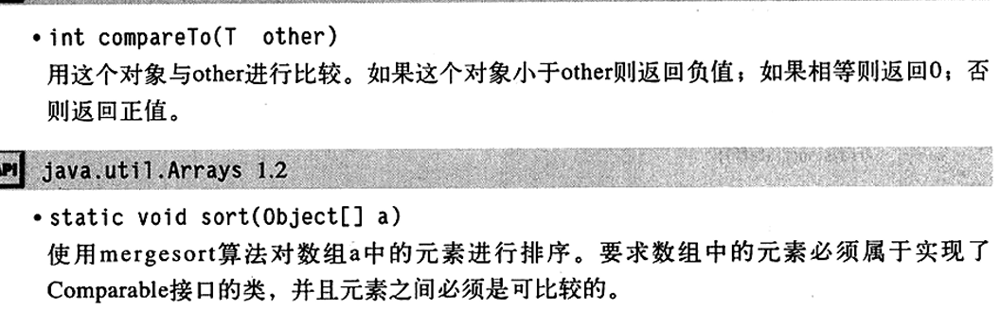
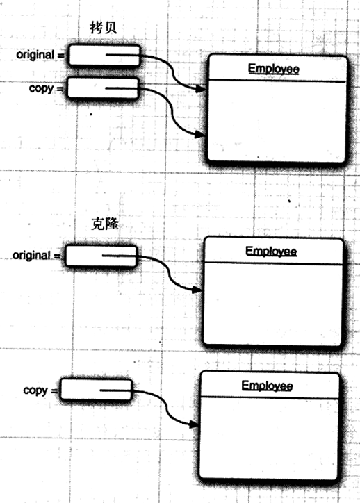
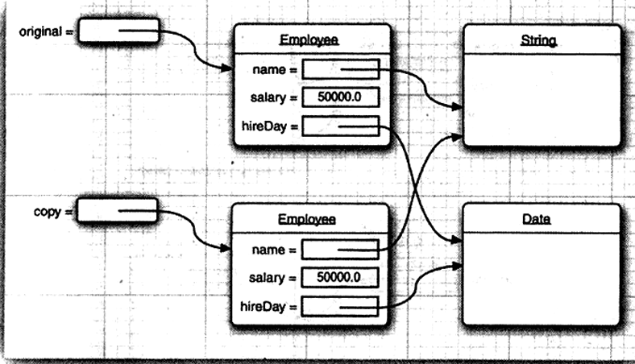
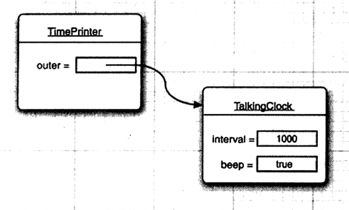
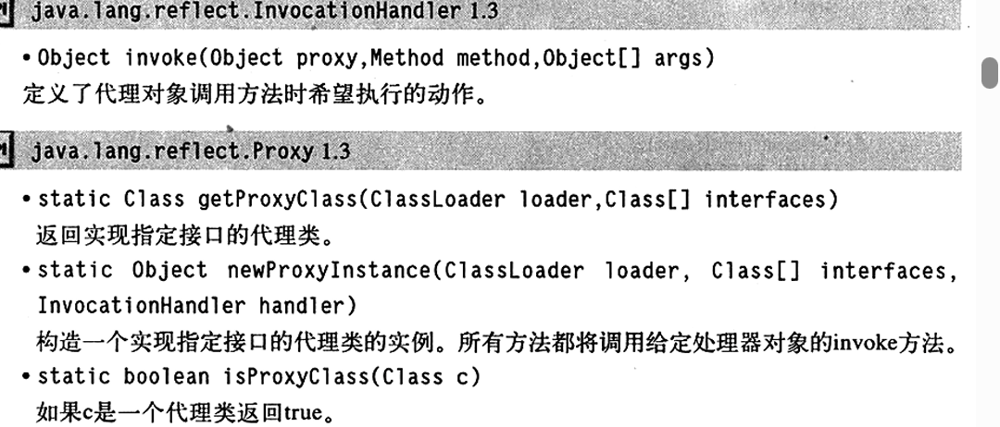

# 接口与内部类

- 接口
- 对象克隆
- 接口与回调
- 内部类
- 代理

接口主要用来描述类具有什么功能，而并不是给出每个功能的具体实现。一个类可以实现一个或多个接口，并在需要接口的地方，随时实现了相应的接口对象

内部类定义在另一个类的内部，其中的方法可以访问包含他们的外部类的域

### 接口

接口不是类，而是类的一组需求描述，这些类要遵从接口描述的统一格式进行定义

``` java
public interface Comparable<T>{
    int compareTo(T other);
}
```

**接口中的所有方法自动地属于public**

x.compareTo(y)，当x小于y时，返回负数；当x大于y时，返回整数；x等于y时，返回0

为了让类实现一个接口，需要下面两个步骤：

1. 将类声明为实现给定的接口
2. 对接口的所有方法进行定义

``` java
class Employee implements Comparable{}
```

Employee需要提供compareTo方法，如果第一个雇员薪水低于第二个则返回-1，相等则返回0，否则返回1

``` java
public int compareTo(Object otherObject){
    Employee other=(Employee) otherObject;
    if(salary<other.salary) return -1;
    if(salary>other.salary) return 1;
    return 0;
}
```

实现接口时必须把方法声明为public，否则编译器会认为这个方法的访问属性是包可见性，即类的默认访问属性，之后编译器会给出试图提供更弱的访问权限的警告信息

``` java
class Employee implements Comparable<Employee>{
    public int compareTo(Employee other){
        if(salary<other.salary) return -1;
        if(salary>other.salary) return 1;
        return 0;
    }
}
```

为什么不能直接在Employee类直接提供一个compareTo方法，而必须实现comparable接口？

``` java
if(a[i].compareTo(a[j])>0){
    //rearrage(重排) a[i] and a[j]
    ...
}
```

**java是一种强类型语言，在调用方法时，编译器会检查这个方法是否存在。编译器要确认a[i]一定有compareTo方法，如果a是comparable对象的数组，就可以确保拥有compareTo方法，因为每个实现Comparable接口的类都必须提供这个方法的定义**

```java
/*
 * @Descripttion: 
 * @version: 
 * @Author: Kzh
 * @Date: 2025-01-26 13:31:53
 * @LastEditors: 2ofus
 * @LastEditTime: 2025-01-26 13:38:56
 */
import java.lang.reflect.Array;
import java.util.Arrays;

public class EmployeeSortTest{
    public static void main(String[] args) {
        Employee[] staff=new Employee[3];
        staff[0]=new Employee("Harry Hacker", 35000);
        staff[1]=new Employee("cark", 1120);
        staff[2]=new Employee("messi",620);
        Arrays.sort(staff);
        for (Employee employee : staff) {
            System.out.println("name="+employee.getName()+",salary="+employee.getSalary());
        }
    }
}

class Employee implements Comparable<Employee>{
    private String name;
    private double salary;
    
    public Employee(String name, double salary) {
        this.name = name;
        this.salary = salary;
    }

    public String getName() {
        return name;
    }

    public void setName(String name) {
        this.name = name;
    }

    public double getSalary() {
        return salary;
    }

    public void setSalary(double salary) {
        this.salary = salary;
    }

    @Override
    public int compareTo(Employee o) {
        // TODO Auto-generated method stub
        if(salary>o.salary) return 1;
        if(salary<o.salary) return -1;
        return 0;
    }

    
    
}
```

结果：

```cmd
name=messi,salary=620.0
name=cark,salary=1120.0
name=Harry Hacker,salary=35000.0
```



如果存在这样的一种通用算法可以对两个不同的子类对象进行比较，则应该在超类提供一个compareTo方法，并将这个方法声明为final

#### 接口的特性

**接口不是类**，接口不能实例化，但是可以声明接口变量，接口变量必须引用实现了接口的类对象

``` java
x=new Comparable(...);//ERROR
Comparable x;//OK
x=new Employee(...);//OK provided Employee implements Comparable
```

可以用instanceof来检查一个对象是否实现了某个特定的接口

**每个类只能拥有一个超类，但却可以实现多个接口**

#### 接口与抽象类

java不允许多继承，其主要原因是多继承会让语言变得非常复杂，效率也会下降

### 对象克隆



当拷贝一个变量，原始变量与拷贝变量引用的是同一个对象，当一个变量所引用的对象将会定另一个变量产生影响

``` java
Employee original=new Employee("John Public",50000);
Employee copy=original;
copy.raiseSalary(10);//oops--also changed original
```

如果创建一个对象的新的copy，它的初始状态与original一样，但以后可以各自改变各自的状态，那就需要用clone方法

``` java
Employee copy=original.clone();
copy.rasieSalary();//OK--original unchanged
```

clone方法是Object类的一个protected方法，用户在编写的代码中不能直接调用他，只有Employee类才能克隆Employee对象

**但是如果在对象包含子对象的引用，拷贝的结果会使得两个域引用相同一个子对象，因此原始对象与克隆对象共享这部分的信息**



这是**浅拷贝**，默认的克隆操作就是浅拷贝，他并没有克隆包含在对象中的内部对象。更常见的是子对象可变，因此需要重新定义clone方法，以便实现克隆子对象的深拷贝

对于每一个类需要做出下列判断：

1. 默认的clone方法是否满足要求
2. 默认的clone方法是否能够通过调用可变子对象的clone得到修补
3. 是否不应该使用clone

实际上，选项3是默认的，如果要选择1或2，类必须：

1. 实现Cloneable接口
2. 使用public访问修饰符重新定义Clone方法

Cloneable接口的出现与接口的正常使用没有任何关系，称为标记接口，即使clone的默认实现能够满足需求，也应该实现Cloneable接口，将clone重定义为public，并调用super.clone()。

``` java
class Employee implements Cloneable{
    public Employee clone() throws CloneNotSupportedException{
        return (Employee) super.clone();
    }
}
```

为实现一个深拷贝：

``` java
class Employee implements Cloneable{
    public Employee clone() throws CloneNotSupportedException{
        Employee cloned=(Employee) super.clone();
        cloned.hireDay=(Date)hireDay.clone();
        return cloned;
    }
}
```

谨慎使用子类的克隆，因为一但为Employee类定义了clone方法，任何人都可用这个方法来克隆Manage对象

每个数组类型均包含了一个clone方法，这个方法被设为public，而不是protected，可以利用这个方法创建一个包含所有数据元素拷贝的一个新的数组

``` java
int[] luckyNumbers={1,3,4,2};
int[] cloned=(int[]) luckyNumbers.clone();
cloned[3]=12;//doesn't change luckyNumbers[3]
```

### 接口与回调

回调是一种常见程序设计模式，在这个模式可以指定某个特定时间发生时应该采取的行动

### 内部类

定义在另一类中的类

- 内部类方法可以访问该类定义所在的作用域中的数据，包括私有的数据
- 内部类可以对同一个包的其他类隐藏起来
- 当想要定义一个回调函数但是不想写大量代码时，使用匿名内部类比较便捷

java内部类有多个好处：命名控制和访问控制，内部类的对象有一个隐式引用，他引用了实例化该内部对象的外围类对象。通过这个指针，访问外围类对象的全部状态

#### 使用内部类访问对象状态

``` java
public class TalkingClock{
    public TalkingClock(int interval,boolean beep){...}
    public void start(){...}
    private int interval;
    private boolean beep;
    //an inner class
    public class TimePrinter implements ActionListenner{
        ...
    }
}
```

此时TimerPrinter类位于TalkingClock类内部，并不意味这每个TalkingClock都有一个TimerPrinter实例域。

``` java
public class TimePrinter implements ActionListenner{
       	public void actionPerformed(ActionEvent event){
            Date now=new Date();
            System.out.println("At the one,the time is "+now);
            if(beep) Toolkit.getDefaultToolkit().beep();
        }
    }
```

TimerPrinter类没有实例域或名为beep的变量，取而代之的是beep引用了创建TimerPrinter的TalkingClock对象的域



外围类在构造器中设置，编译器修改了所有内部类的构造器，添加了一个外部类的参数。因为TimerPrinter类没有定义构造器，所有编译器为这个类生成了一个默认的构造器

``` java
public TimerPrinter(TalkingClock clock){
    outer=clock;
}
```

#### 内部类的特殊语法规则

``` java
OuterClass.this
```

表示外围类引用。

``` java
public void actionPerformed(ActionEvent event){
            ...
            if(TalkingClock.this.beep) Toolkit.getDefaultToolkit().beep();
        }
```

可以采用下面语法格式更加明确地编写内部对象的构造器

``` java
outerObject.new InnerClass(constryction parameters)
```

例如

```java
ActionListener listener=this.new TimerPrinter();
```

最新的TimerPrinter对象的外围类被设置为创建内部类对象的方法中的this引用

在外围类的作用域之外，可以这样引用内部类

```java
OuterClass.InnerClass
```

#### 内部类是否有用、必要和安全

``` cmd
javap -private ClassName
```

可以看到实际编译器运行代码

结论：如果内部类访问了私有数据域，就极有可能通过附加在外围类所在包的其他类访问他们，但这有着极高的难度

#### 局部内部类

``` java
public void start(){
    class TimePrinter implements ActionListenner{
       	public void actionPerformed(ActionEvent event){
            Date now=new Date();
            System.out.println("At the one,the time is "+now);
            if(beep) Toolkit.getDefaultToolkit().beep();
        }
    }
    ActionListener listener=new TimePrinter();
    Timer t=new Timer(interval,listener);
    t.start();
}
```

局部类不能通过public或private访问说明符来声明，他的作用域被限定在声明这个局部类的块

局部块有一个优势，即对外部世界可以完全地隐藏起来

#### 由外部方法访问final变量

与其他内部类相比，局部类还有一个优点。他们不仅能访问包含他们的外部类，还可以访问局部变量。不过这些局部变量必须被 声明为final

```java
public void start(int interval,final boolean beep){
    class TimePrinter implements ActionListenner{
       	public void actionPerformed(ActionEvent event){
            Date now=new Date();
            System.out.println("At the one,the time is "+now);
            if(beep) Toolkit.getDefaultToolkit().beep();
        }
    }
    ActionListener listener=new TimePrinter();
    Timer t=new Timer(interval,listener);
    t.start();
}
```

TalkingClock类不再存储实例变量beep了，而是引用start方法中的beep参数

控制流程：

1. 调用start方法
2. 调用内部类的TimePrinter的构造器，以便初始化对象变量listenner
3. 将listenner引用传递给Timer构造器，定时器开始计时，start方法结束，此时start方法的beep参数变量不复存在
4. 然后，actionPerformed方法执行if（beed）...

#### 匿名内部类

```java
public void start(int interval,final boolean beep){
	ActionListener listener=new ActionListener(){
       	public void actionPerformed(ActionEvent event){
            Date now=new Date();
            System.out.println("At the one,the time is "+now);
            if(beep) Toolkit.getDefaultToolkit().beep();
        }
    };
    Timer t=new Timer(interval,listener);
    t.start();
}
```

#### 静态内部类

有时，使用内部类只是为了把一个类隐藏在另一个类的内部，并不需要内部类引用外围对象。为此，可以将内部类声明为static，以便取消产生的引用

``` java
class ArrayAlg{
    public static Pair minmax(double[] values){
        ...
		return new Pair(min,max);
    }
}
class Pair{
    public Pair(double f,double s){
        first=f;
        second=s;
    }
    public double getFirst(){return first;}
    public double getSecond(){return second;}
    private double first;
    private double second;
}
```

如果没有将Pair类声明为static，那么编译器将会给出错误报告

### 代理

代理类可以在运行时创建全新的类，这样的代理类可以实现指定的接口。他有如下方法：

- 指定接口所需要的全部方法
- Object类中的全部方法

然而并不能在运行时定义这些方法的新代码，而是需要提供一个调用处理器。**调用处理器是实现InvocationHandler接口的类对象**

这个接口只有一个方法：

``` java
Object invoke(Object proxy,Method method,Object[] args)
```

无论何时调用代理处理对象的方法，调用器的nvoke方法都会被调用，并向其传递Method对象和原始的调用参数。调用处理器必须给出处理调用的方式

想要创建一个代理对象，需要使用Proxy类的newProxyInstance方法，这个方法有三个参数：

- 一个类加载器
- 一个Class对象数组，每个元素都是需要实现的接口
- 一个调用处理器

使用代理机制可以解决什么问题：

- 路由对远端服务器的方法调用
- 在程序运行期间，将用户接口与动作关联起来
- 为调试、跟踪方法调用

#### 代理的特性

所有的代理类都拓展与Proxy类，一个代理只有一个实例域——调用处理器，他定义在Proxy的超类中

