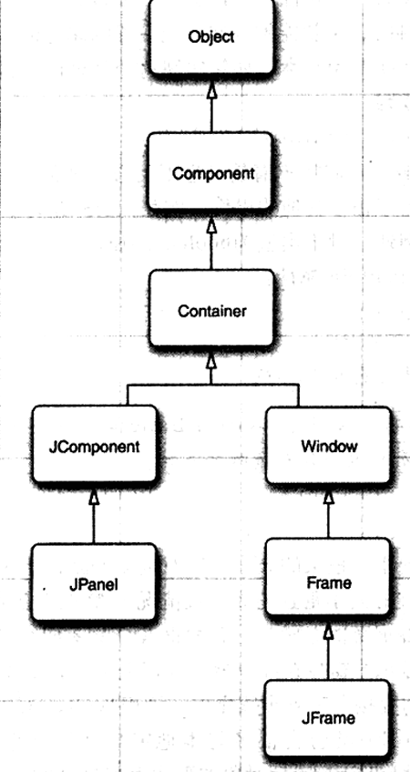
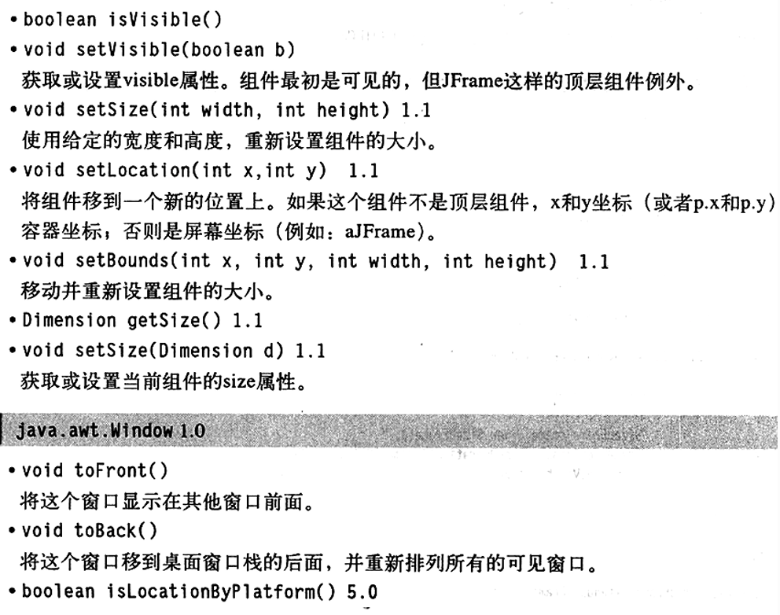
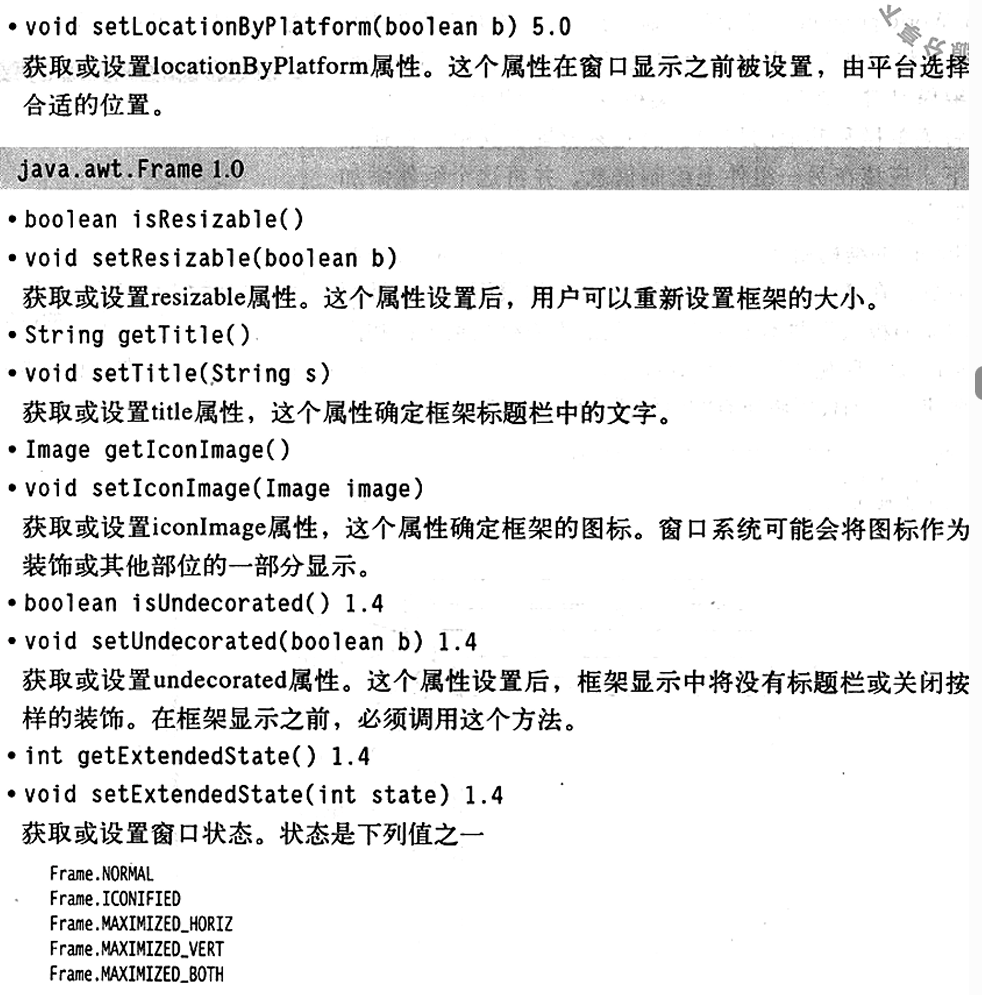
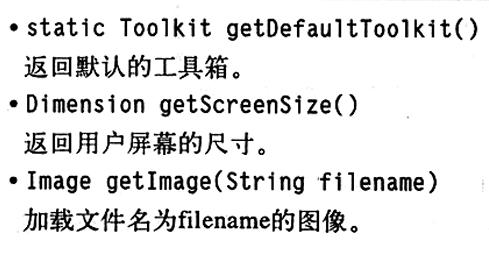
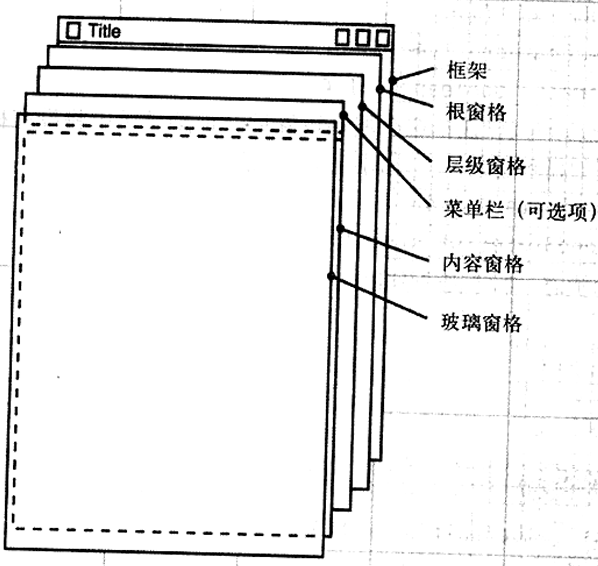
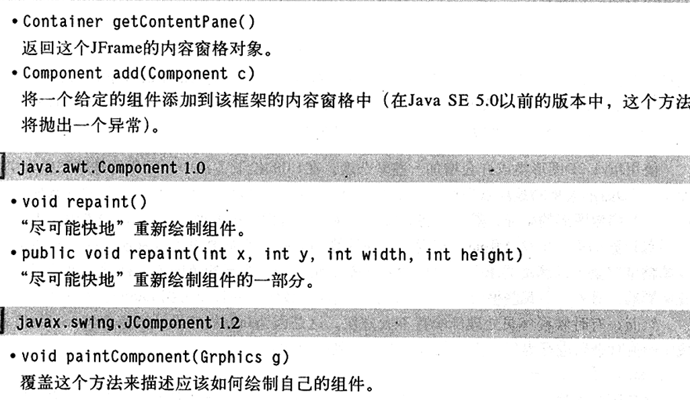

# 图形程序设计

如何编写GUI的java程序

### Swing

Swing的优点：

- 拥有一个丰富、便携的用户界面元素集合
- 对底层平台依赖的少，因此与平台有关的bug很少
- 给不同平台的用户一致的感觉

###  创建框架

在Java中，顶层窗口被称为框架（frame），Swing版本叫做JFrame，他拓展于Frame类。JFrame是极少数几个不绘制在画布上的Swing组件之一。

```java
import javax.swing.JFrame;

public class SimpleFrameTest {
    public static void main(String[] args) {
        SimpleFrame frame=new SimpleFrame();
        frame.setDefaultCloseOperation(JFrame.EXIT_ON_CLOSE);
        frame.setVisible(true);
    }
}
class SimpleFrame extends JFrame{
    public SimpleFrame(){
        setSize(DEFAULT_WIDTH, DEFAULT_HEIGHT);
    }
    public static final int DEFAULT_WIDTH=300;
    public static final int DEFAULT_HEIGHT=200;
    
}
```

所有Swing组件必须由事件调度线程进行配置，线程将鼠标点击和键盘敲击控制转移到用户接口组件

在初始化语句结束后，main方法退出，此时退出main并没有终止程序，终止的只是主线程。事件调度线程保持程序处于激活状态，直到关闭框架或调用System.exit方法终止程序

### 框架定位

JFrame本身包含若干个改变框架外观的方法：

- setLocation和setBounds方法设置框架的位置
- setIconImage用于告诉窗口系统在标题栏、任务切换窗口等显示哪个图标
- setTitle用于改变标题栏的文字
- set‘Resizable利用boolean值确定框架大小是否允许用户改变

setLocation(x,y)设置窗口距离左上角水平x像素，垂直y像素的位置



setBounds（x,y,width,height）可以控制位置和大小

### 框架属性

组件类中的很多方法是以获取/设置这一对操作形式出现的

``` java
public String getTiltle();
public void setTitle(String title);
```

这样获取/设置对被称为一种属性，属性包括属性名和类型。从概念上讲，title是框架的一个属性，当设置这个属性时，希望这个标题能够改变用户屏幕的显示。当获取这个属性时，希望能够返回已经设置的属性值

对于boolean的属性，获取类方法用is开头

``` java
public boolean isLocationByPlatform();
public void setLocationByPlatform(boolean b);
```

### 决定框架的大小

如果没有明确指定框架大小，所有框架的默认值均为0$\times $0像素

为了得到屏幕大小，可以这样做

``` java
Toolkit kit=Toolkit.getDefaultToolkit();
Dimension screenSize=kit.getScreenSize();
int screenWidth=screenSize.width;
int screenHeight=screenSize.height;
```

讲框架大小设为上面取值的50%，然后告知窗口系统定位框架：

``` java
setSize(screenWidth/2,screenHeight/2);
setLocationByPlatform(true);
```

另外提供一个图标

``` java
Image img=kit.getImage("icon.gif");
setIconImage(img);
```

完整代码：

```java
import javax.swing.*;
import java.awt.*;

public class SizedFrameTest {
    public static void main(String[] args) {
        EventQueue.invokeLater(new Runnable() {

            @Override
            public void run() {
                // TODO Auto-generated method stub
                SizedFrame frame=new SizedFrame();
                frame.setDefaultCloseOperation(JFrame.EXIT_ON_CLOSE);
                frame.setVisible(true);
            }
            
        });
    }
}
class SizedFrame extends JFrame{
    public SizedFrame(){
        Toolkit kit=Toolkit.getDefaultToolkit();
        Dimension screenSize=kit.getScreenSize();
        int screenWidth=screenSize.width;
        int screenHeight=screenSize.height;
        setSize(screenWidth/2,screenHeight/2);
        setLocationByPlatform(true);
        Image img=kit.getImage("icon.jpg");
        setIconImage(img);
        setTitle("SizedFrame");
    }
}
```







### 在组件中显示信息

JFrame的结构



JFrame有四层面板，其中根面板、层级面板和玻璃面板是用来组织菜单栏和内容窗口和实现观感的，Swing最关注的是内容窗口（content pane）

``` java
Containner contentPane=frame.getContentPane();
Component c=...;
contentPane.add(c);
```

在java SE 5.0 中可以直接调用

``` java
frame.add(c);
```

如果打算将一个绘制消息的组件添加到框架中，绘制一个组件，就需要定义一个拓展JComponent的类，并覆盖其中的paintComponent方法

paintComponent方法有一个Graphics类型的参数，这个参数保持着用于绘制图像和文本的设置，在java中，所有绘制都必须使用到Graphics对象

``` java
class MyComponent extends JComponent{
    public void paintComponentP(Graphics g){
        code for drawing
    }
}
```

无论何种原因，只要窗口重新绘图，事件处理器就会通告组件，从而引发执行所有组件的paintComponent方法

一定不要自己调用paintComponent方法，在应用程序需要重新绘图时，这个方法将自动地调用，不要人为干预这个自动的处理过程

**如果需要强制刷新屏幕，就需要调用repaint方法**


``` java
class MyComponent extends JComponent{
    public void paintComponentP(Graphics g){
        g.drawString("Not a Hello,Wold Program",MESSAGE_X,MESSAGE_Y);
    }
    public static final int MESSAGE_X=75;
    public static final int MESSAGE_Y=100;
}
```

如果使用JPanel，面板不透明，一位着需要在面板的边界内绘制所有的像素，一般用下面方法

``` java
class NotHelloWorldPanel extends JPanelP{
    public void paintComponent(Graphics g){
        super.paintComponent(g);
        ...//code for drawing will go here
    }
}
```

代码：

```java
import java.awt.EventQueue;
import java.awt.Graphics;

import javax.swing.JFrame;
import javax.swing.JPanel;


public class NotHelloWorld {
    public static void main(String[] args) {
        EventQueue.invokeLater(new Runnable() {

            @Override
            public void run() {
                // TODO Auto-generated method stub
                NotHelloWorldFrame notHelloWorldFrame = new NotHelloWorldFrame();
                notHelloWorldFrame.setDefaultCloseOperation(JFrame.EXIT_ON_CLOSE);
                notHelloWorldFrame.setVisible(true);
            }
            
        });
    }
}
class NotHelloWorldFrame extends JFrame{
    public NotHelloWorldFrame(){
        setTitle("NotHelloWorld");
        setSize(DEFAULT_WIDTH, DEFAULT_HEIGHT);
        NotHelloWorldPanel panel=new NotHelloWorldPanel();
        add(panel);
    }
    public static final int DEFAULT_WIDTH=300;
    public static final int DEFAULT_HEIGHT=200;
    
}

class NotHelloWorldPanel extends JPanel{
    public void paintComponent(Graphics g){
        g.drawString("Not a Hello,World program", MESSAGE_X, MESSAGE_Y);
        
    }
    public static final int MESSAGE_X=75;
    public static final int MESSAGE_Y=100;
}
```



### 2D图形

269