# 深入Web请求过程

随着Web2.0的到来，网络架构已经从传统的C/S架构转变为更加方便、快捷的B/S架构，这个新架构打打简化了用户使用网络应用的难度

B/S架构带来两方面的好处：

- 客户端使用统一的浏览器
- 服务端基于统一的HTTP

### B/S网络架构概述

B/S网络架构从前端到后端都得到了简化，都是基于统一的应用层协议HTTP来交互数据。通常情况下，一次请求就完成了一次数据交互，通常也对应一个业务逻辑，然后这次通信连接就断开了。采用这种方式是为了能够同时服务更多的用户。

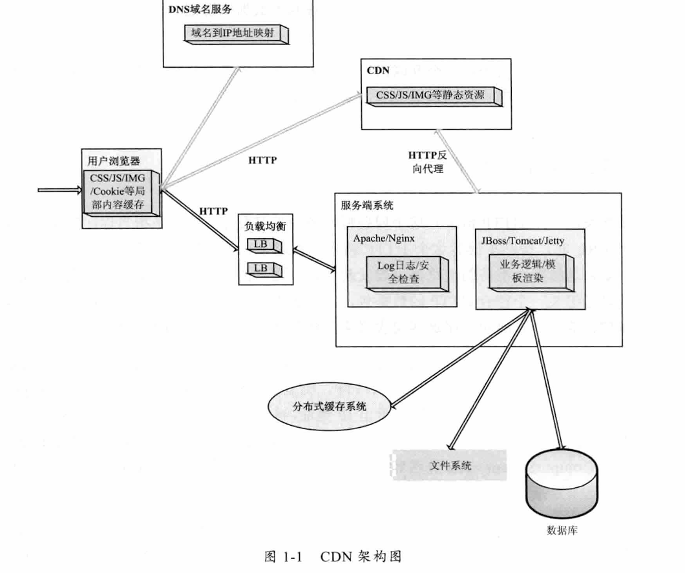

当一个用户在浏览器里输入www.taobao.com这个url，将会发生很多操作：

1. 他会请求DNS把这个域名解析成对应的IP地址，然后根据这个IP地址在互联网上找到对应的服务器
2. 服务器可能有很多台，到底指定哪台服务器来处理请求，这需要一个负载均衡设备来分配所有用户的请求
3. 请求数据存储在分布式缓存还是静态文件，或是数据库
4. 当数据返回浏览器时，浏览器解析数据发现还有一些静态资源时又会发起另外的HTTP请求

无论网络架构如何变化，始终有一些固定不变的原则需要遵守：

- 互联网上所有资源都要用一个URL来表示
- 必须基于HTTP与服务端交互
- 数据展示必须在浏览器中进行

满足上面几点，一个互联网应用基本上就能正常地运转起来了

### 如何发起一个请求

复杂是指能否不借助浏览器也能发起请求，不借助的两层含义：

- 能不能自己组装一个符合Http的数据包
- 处理浏览器还有哪些方式也能简单地发起一个HTTP请求

如何发起一个HTTP请求和建立一个Socket连接区别不大，只不过outputStream.write写的二进制数据格式更要符合HTTP

发送一个HTTP请求的过程就是建立一个Socket通信的过程

**30页看不懂也写不出来**

### HTTP解析

B/S网络架构的核心是HTTP，要理解HTTP最重要的是熟悉HTTP中的HTTP Header，HTTP Header控制这互联网上成千上万的用户的数据的传输。最关键的是，他控制着用户浏览器的渲染行为和服务端的执行逻辑。

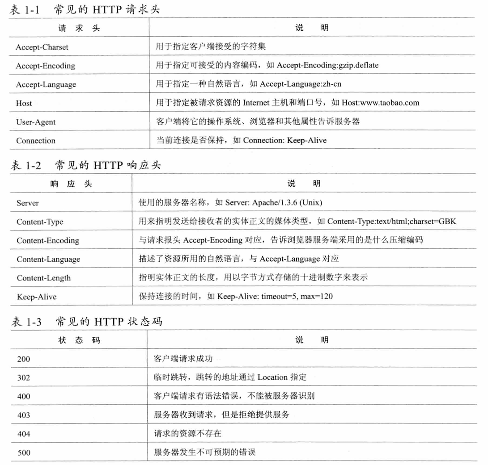

#### 查看HTTP信息的工具

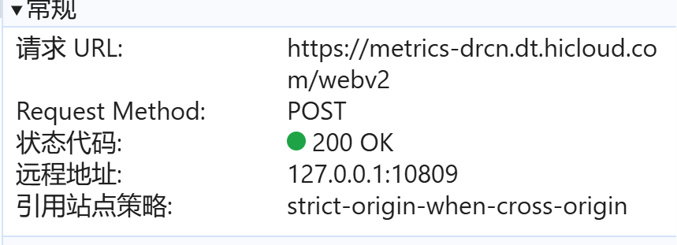

自己看

#### 浏览器缓存机制

为什么Ctrl+F5可以刷新页面：

- 在浏览器端，如果是按Ctrl+F5组合刷新页面，那么浏览器会直接向目标URL发送请求，而不会使用浏览器缓存的数据
- 其次即使请求发送到服务端，也有可能访问到的是缓存的数据

所以为了保证用户能够看到最新的数据，必须通过HTTP来控制

请求从服务端返回的数据，最重要的是在其请求头中增加了两个请求项Pragma:no-cache 和Cache-Control:no-cache

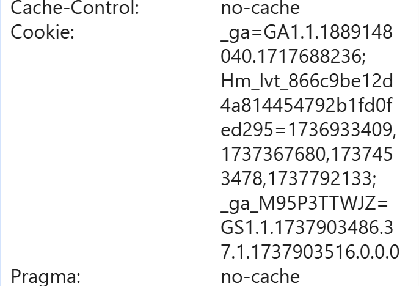

使用的网站

[浏览器的缓存机制-彻底理解强缓存与协商缓存看这篇就够了 - chen - 博客园](https://www.cnblogs.com/chenhuichao/p/14325953.html)

##### Cache-Control/Pragma

这个HTTP Head字段用于指定所有缓存机制在整个请求/响应链中必须服从的指令。如果知道该页面是否为缓存，不仅能控制浏览器，还可以控制和HTTP相关的缓存或代理服务器

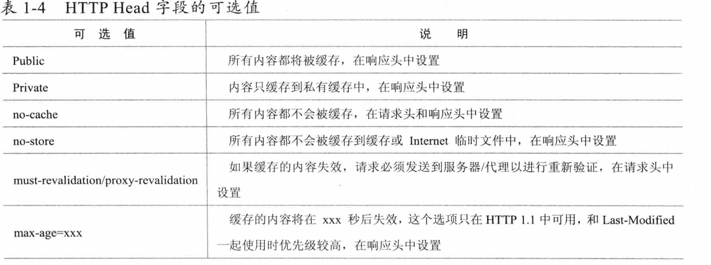

Cache-Control字段被各个浏览器支持的较好，而且他的优先级也比较高，他和其他一些请求字段一起同时出现时，Cache-Control会覆盖其他字段

Pragma的作用和Cache-Control有点类似，他也是HTTP头中包含一个特殊指令，使相关的服务器遵守该指令

##### Expires

Expires通常的格式是Expires：Sat,25 Feb 2012 12:22:17 GMT，后面跟着一个日期和时间，超过这个时间值后，缓存的内容将失效

##### Last-Modified/Etag

 Last-Modified字段一般用于表示一个服务器上的资源的最后修改时间，资源可以是静态或动态的内容，通过这个最后修改时间可以判断当前请求的资源是否是最新的。

一般服务端在响应头中返回一个Last-Modified字段，告诉浏览器这个页面的最后修改时间，如Last-Modified：Sat,25 Feb 2012 12:55:01 GMT

再在请求头中添加一个If-Last-Modified：Sat,25 Feb 2012 12:55:01 GMT，寻文当前缓存的页面是否是最新

与Last-Modified有着类似功能的是Etag

### DNS域名解析

URL需要解析成IP地址才能与远程主机连接

#### DNS域名解析过程

当用户在浏览器中输入域名并按下回车键后

第一步，浏览器会检查缓存中有没有这个域名对应的解析过的IP地址，如果缓存中有，这个解析过程就结束

第二步，如果用户的浏览器缓存没有，浏览器会查找操作系统缓存中是否有这个域名队形的DNS解析结果

第三步，如何、怎么知道域名服务器？我们的网络配置中都有DNS服务器地址这一项，如果前面两个过程无法接续，操作系统将这个域名发送到这里设置的LDNS，也就是本地区的域名服务器

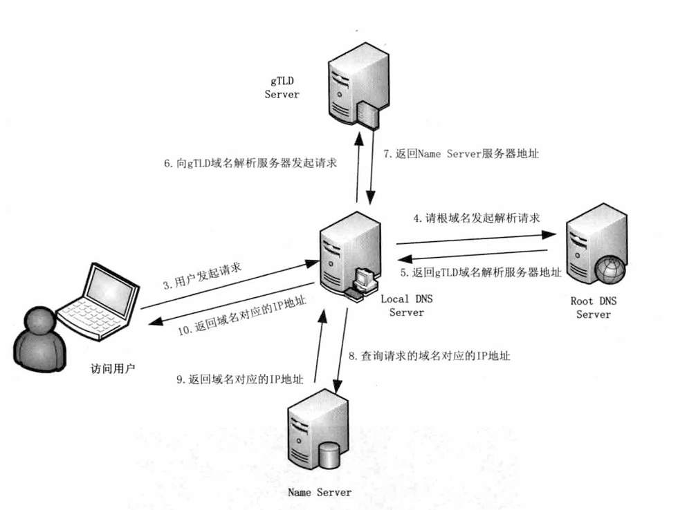

```cmd
 ipconfig
```

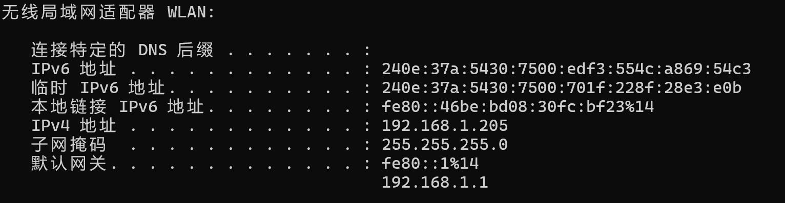

基本上80%的域名解析到这里就已经完成了

第四步，假如LDNS仍然没有命中，就直接到Root Server域名服务器请求解析

第五步，根据域名服务器返回给本地域名服务器一个所查询域的主域名服务器（gTLD Server）地址。gTLD是国际顶级域名服务器，如.com,.cn,.org等

第六步，本地域名服务器（Local DNS Server）再向上一步返回gTLD服务器发送请求

第七步，接收请求的gTLD服务器查找并返回此域名对应的Name Server域名服务器地址，这个Name Server通常是你注册的域名服务器

第八步，Name Server域名服务器会查询存储的域名和IP的映射关系表，在正常情况下都根据域名得到目标IP记录，连同一个TTL值返回给DNS Server域名服务器

第九步，返回该域名对应的IP和TTL值，Local DNS Server会缓存这个域名和IP的对应关系，缓存时间由TTL值控制

第十步，把解析结果返回给用户，用户根据TTL值缓存在本地系统缓存中，域名解析过程结束

#### 跟踪域名解析过程

Linux和Windows用nslookup可以来查询域名的解析结果

``` cmd
C:\Users\86177>nslookup
默认服务器:  UnKnown
Address:  fe80::1

> www.baidu.com
服务器:  UnKnown
Address:  fe80::1

非权威应答:
名称:    www.a.shifen.com
Addresses:  240e:ff:e020:966:0:ff:b042:f296
          240e:ff:e020:9ae:0:ff:b014:8e8b
          183.2.172.42
          183.2.172.185
Aliases:  www.baidu.com
```

Linux系统还可以使用dig命令来查询DNS解析过程

``` shell
root@hcss-ecs-e795:~# dig www.baidu.com

; <<>> DiG 9.18.12-0ubuntu0.22.04.2-Ubuntu <<>> www.baidu.com
;; global options: +cmd
;; Got answer:
;; ->>HEADER<<- opcode: QUERY, status: NOERROR, id: 10973
;; flags: qr rd ra; QUERY: 1, ANSWER: 3, AUTHORITY: 0, ADDITIONAL: 1

;; OPT PSEUDOSECTION:
; EDNS: version: 0, flags:; udp: 65494
;; QUESTION SECTION:
;www.baidu.com.                 IN      A

;; ANSWER SECTION:
www.baidu.com.          167     IN      CNAME   www.a.shifen.com.
www.a.shifen.com.       51      IN      A       183.2.172.42
www.a.shifen.com.       51      IN      A       183.2.172.185

;; Query time: 0 msec
;; SERVER: 127.0.0.53#53(127.0.0.53) (UDP)
;; WHEN: Mon Jan 27 18:24:16 CST 2025
;; MSG SIZE  rcvd: 101
```

#### 清除缓存的域名

Windows可以用

```cmd
C:\Users\86177>ipconfig/flushdns

Windows IP 配置

已成功刷新 DNS 解析缓存。
```

Linux可以用

``` shell
sudo /etc/init.d/nscd restart
```

#### 几种域名解析方式

- A记录
- MX记录
- CNAME记录
- NS记录
- TXT记录

### CDN工作机制

CDN也就是内容分布式网络，他是架构在现有Internet上的一种先进的流量分配网络

CDN=镜像+缓存+整体负载均衡

CDN的目标：

- 可拓展性
- 安全性
- 可靠性、响应和执行

#### CDN架构

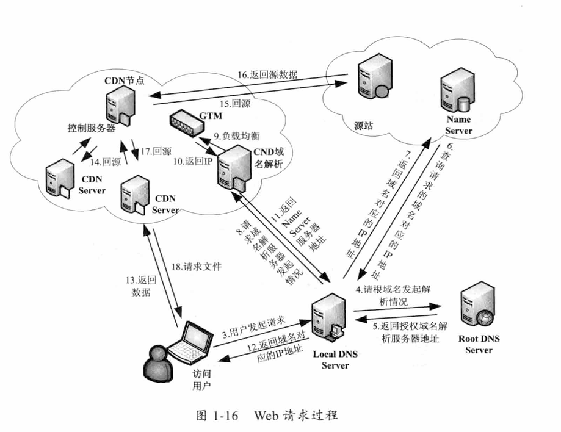

#### 负载均衡

负载均衡就是对工作任务进行平衡、分摊到多个操作单元上执行。如图片服务器、应用服务器等，共同完成工作任务。他可以提高服务器响应速度及利用效率，避免软件或硬件模块出现单点失效，解决网络拥塞问题，实现地理位置无关性，为用户提供较一致的访问质量

通常有三种均衡架构，分别是链路负载均衡、集群负载均衡和操作系统均衡

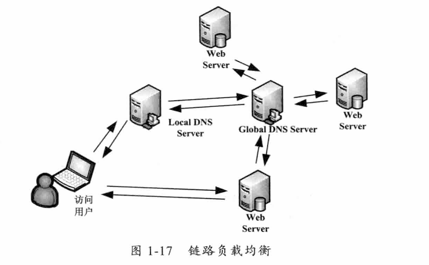

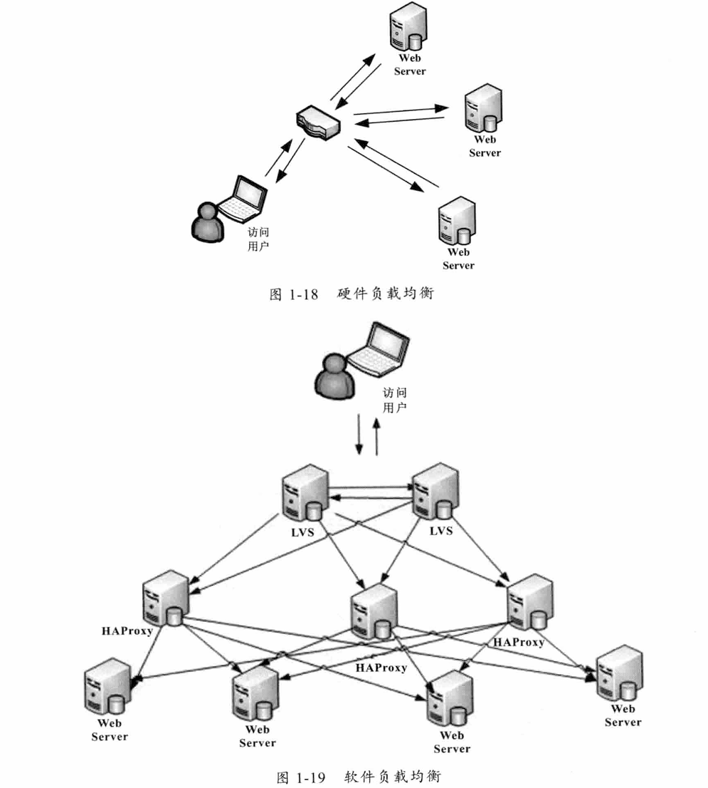

集群负载均衡分为硬件负载均衡和软件负载均衡

操作系统负载均衡，就是利用操作系统级别的软中断或硬中断来达到负载均衡

#### CDN动态加速

CDN动态加速技术原理就是在CDN的DNS解析中通过动态的链路探测来寻找回源最好的路径，通股票DNS的调度将所有请求调度到选定的这条路径上回源，从而加速用户访问的效率

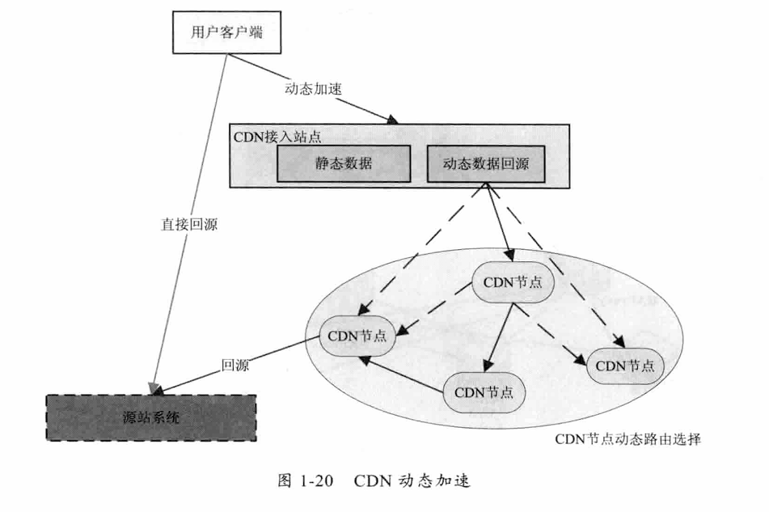

由于CDN节点是遍布全国的，所以用户接入一个CDN节点后，可以选择一条从离用户最近的CDN节点到源站链路最好的路径让用户走

