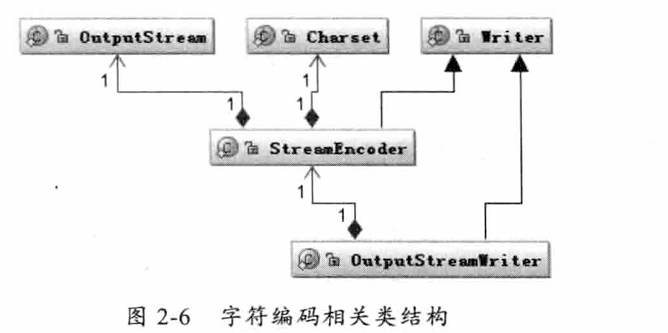

## 深入分析Java I/O的工作机制

### Java的I/O类库的基本架构

- 基于字节操作的I/O接口：InputStream和OutputStream
- 基于字符操作的I/O接口：Writer和Reader
- 基于磁盘操作的I/O接口：File
- 基于网络操作的I/O接口：Socket

前两组主要是传输数据的数据格式，后两种主要是传输数据的方式

#### 基于字节的I/O接口

一是操作数据的方式是可以组合使用的，例如

``` java
OutputStream out=new BufferedOutputStream(new ObjectOutputStream(new FileOutputStream("fileName")));
```

二是必须要指定流最终写到什么地方，写到磁盘或网络

#### 基于字符操作的I/O接口

``` java
int read(char cbuf[],int off,int len);
//返回读到的n个字节数
```

#### 字节与字符的转换接口


InputStreamReader类是从字节到字符的转换桥梁，从InputStream到Reader的过程要指定编码字符集，否则将采用操作系统默认的字符集，可能会出现乱码

``` java
try{
    StringBuffer str=new StringBuffer();
    char[] buf=new char[1024];
    FileReader f=new FileReader("file");
    while(f.read(buf)>0){
        str.append(buf);
    }
    str.toString();
}catch(IOException e){
    
}
```

